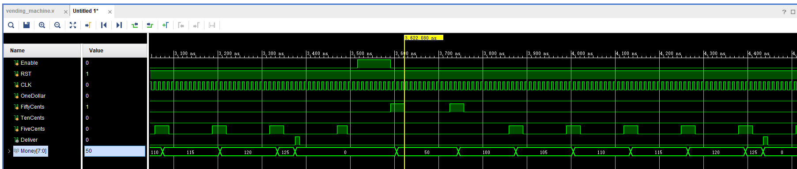
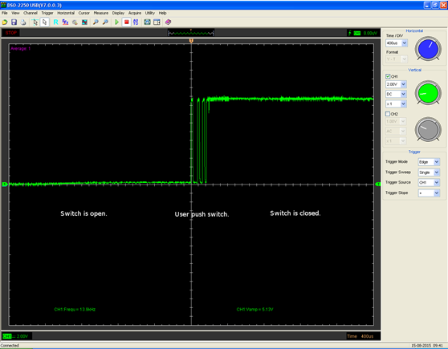
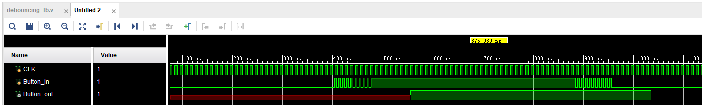

# Introduction
We need to design a finite state machine for a vending machine. The vending machine can accept coins of 1 Dollar, 50 cents, 10 cents and 5 cents. The price for any item sold in the vending machine will be set at startup. In cents, the selling price is the full multiples of 5 and never greater than $1.25. When the inserted coins are more than the price, the vending machine will release the item and change.

# Declaration of the top-level
Please use the entity declaration as below：
```
module vending_machine(
input Enable, input RST, input CLK,
input OneDollar, input FiftyCents, input TenCents, input FiveCents,
output Deliver,
output [7:0] Money);
parameter Price = 125;

module debouncing(
input CLK,
input ButtonIn,
output reg ButtonOut
);
```
# Requirements
In this lab, you do not have to test the code on board, write a testbench and generate the right waveform.

## Vending Machine
+ You should `Enable` the vending machine before you throw coins.
+ Each coin input will enter a square-wave pulse at the corresponding port. Due to the special construction of the mechanism, only one coin is thrown at a time. That is, there will not be two square-wave pulses at the same time.
+ Besides, the pulse generated by each throw will last for over 20 cycle.
+ The parameter `Price` can be changed according to you. You can see the amount of coins according to `Money`. Once the amount of coins reach the `Price`, then `Deliver` will be set to 1 for one cycle and the vending machine will go back to default state and wait for next purchuse.
\
As you can see in the simulation waveform, for the first time the Money reaches $1.25, the `deliver` goes to 1 for onecycle, then the vending machine go back to default state and the `Money`. In the waveform from 3400ns to 3500ns, there is a `FiveCent` pulse, however, the `Money` doesn't change since the vending machine is not enabled. After the vending machine is enabled again, 2 FiftyCent and 5 FiveCent coins are thrown into the vending machine, once the `Money` reaches $1.25 the `Deliver` is set to 1 again and the vending machine go back to default state.

## Debouncing
We mentioned that for every coin we put in, we would produce a square wave pulse, but in reality we were unable to do this due to the limitations of the device. we used a button switch to simulate a coin insert operation. Pressing the switch once may produce the signal shown in the following figure.\
\
Note that there are multiple ups and downs in the waveform. Because the clock frequency is very fast, a single coin toss may be treated as multiple tosses without additional processing. This can take a toll on our customers, so we need to address this issue. The intuitive idea is that when the signal changes, we should wait and see, and if it doesn't change again after a while, we think of it as a stable signal rather than a noise. On the contrary, if it changes while we wait, we dismiss it as a wobble and ignore the change. Multiple ups and downs in the waveform are given in the testbench.\
\
As you can see in the waveform, the ButtonOut doesn't change until the ButtonIn remains stable for enough cycles.

## Detail
+ In this simulation, the jitter of the coin signal will not exceed 5 cycles.
+ FSM and Switch Debouncing should be implemented as separate components
+ Each component should implement and can only implement its own functionality!
+ The experiments in this course force you to use a structure that separates the timing logic from the combinatorial logic. You can refer to the courseware to write the finite state machine as two or three processes. The caveat is that you have to completely separate the combinatorial logic from the timing logic. It is not acceptable to use clocks in the combinatorial logic, or to add too much logic judgment to the timing logic.
+ Draw state transition diagram and system block diagram before you start writing code.

# Reference
+ The difference bewteen '<=' and '='\
https://blog.csdn.net/chief_cf/article/details/52373831

# Submit
+ You should submit:
    1. Code for debouncing module and corresponding testbench that can shown your code is working well.
    2. The state transition diagram for the vending machine, draw it by computer rather than your hand
    3. Code for vending machine and corresponding testbench that can show your code is working well.
    4. The screenshot of the simulation like above
    5. In this lab, the vending machine and the debouncing module is require to be implemented seperately, you can also combine them together and write a testbench for it.\
+ All the pictures should be packaged in a pdf file. All of these files should be compressed in zip format and renamed as this: 
	
		ECE_GY_6483.HW1.[Name].[ID].zip
	

+ For example, the zip file name is: 
	
		ECE_GY_6483.HW1.XinzheLiu.N12209886.zip

+ File Organization Schema in Package:

        ECE_GY_6483.HW1.[Name].[ID].zip
        ├─ debouncing.v
        └─ debouncing_tb.v
        └─ vending_machine.v
        └─ vending_machine_tb.v
        └─ picture.pdf

+ Submit method
	1. Send an email to TA (xinzhe.liu@nyu.edu) with the compressed package as an attachment.
	2. The title of email **MUST** start with "[ECE-GY 6483][HW2]". For example: "[ECE-GY 6483][HW2] Submission from Liu Xin'zhe."

+ Deadline
	1. Deadline at 6 pm on September 29, 2021.
	2. Late submission within 48 hours will only get 80% of the score for this homework. For example, if your score for this homework is 80, then only 64 will be entered into the total score.
	3. All points will be lost if you are late for more than 48 hours.

# Criteria
+ FSM state transmission diagram 10
+ vending_machine.v+vending_machine_tb.v 20
+ debouncing.v+debouncing_tb.v 10
