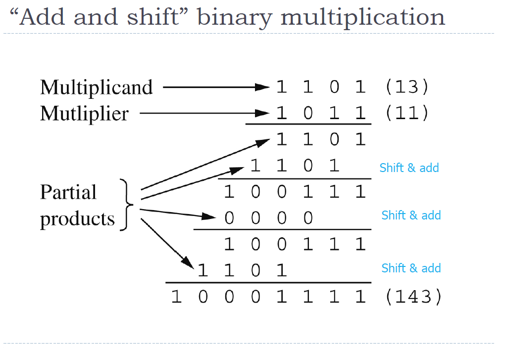
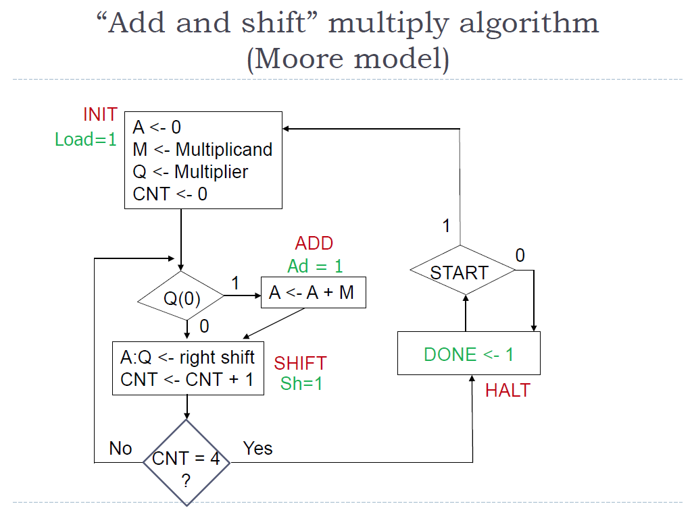
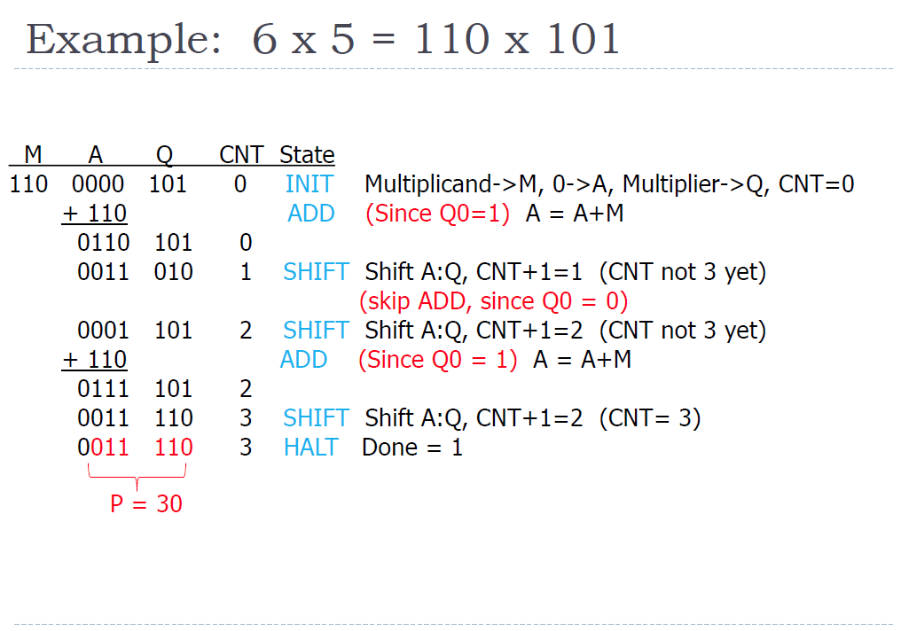

# Introduction
In this experiment, you will need to implement a m×n multiplier **from scratch**. Note that "starting from scratch" means that you cannot directly use the methods already available in the standard library. As the name implies, **you can only “add” and “shift” data**.
This is not a course on digital circuits, so we will detail the calculation method, which you will just need to implement in a hardware description language.
You can also compare the predefined multiplex implementations with your implementation at the end of the experiment, which will help you understand the importance of "Don't reinvent the wheel"

# Algorithm
## How to hand computation binary multiplication


## Algorithm block diagram (Moore model)


## Example: 6×5=110×101


# Declare of top level
To facilitate automatic scoring, the declaration of the top-level function **must be exactly the same** as the following.
```Verilog
module MUL
#(
    parameter nq = 3,
    parameter nm = 3
)
(
    input               clk,
    input               rst,
    input               start,
    input   [nm-1:0]    multiplicand,
    input   [nq-1:0]    multiplier,

    output              done,
    output  [nm+nq-1:0] product
)
```

# Behavior of test-bench
In order to facilitate automatic scoring, the behavior of your testbench **must be exactly the same** as the following.
```Verilog
integer i, j;
initial begin
    rst_sig = 1'b1;
    @(posedge clk_sig); #1;
    for (i = (2**nm)-1; i >= 0; i = i - 1) begin
        for (j = (2**nq)-1; j >= 0; j = j - 1) begin
            multiplicand_sig = i;
            multiplier_sig = j;
            product_ref = i * j;
            start_sig = 1'b1;
            @(posedge clk_sig); #1;
            start_sig = 1'b0;
            @(posedge done_sig); #1;
            if (product_ref == product_sig)
                is_right = 1'b1;
            else
                is_right = 1'b0;
            @(posedge clk_sig); #1;
        end
    end
end
```

# Requirments
1. The algorithm can be divided into **Two** parts: **operator** and **controller**. This experiment requires you to use **more than two different modules** to implement this algorithm. **No data processing is allowed in the controller.**
2. You need to use finite state machines (**FSM**) to implement controller. For finite state machines, you can find examples in Professor Ha's courseware. 
3. The experiments in this course forces you to separates the timing logic from the combinatorial logic. It is not acceptable to use clocks in the combinatorial logic. At least in FSM, two-stage or three-stage should be used.
4. Note that this lab we should write a multiplier for m×n bits, so the use of parameter is necessary. To conserve resources, **No more than <font color=red>2m+n+1</font> registers may be used in operator part, and no more than <font color=red>m+1</font> adders may be used in operator part.**
5. Draw state transition diagram and system block diagram **before** you start writing code.
6. The state transition diagram should contain the following key points and distinguish them in different formats:
    1. Name of state
    2. Conditions for transitioning from one state to another
    3. Value of control signal in each state (or during the transition from one state to another)
7. The system block diagram should contain the following key points:
    1. Components and name of each component
    2. Signals and name of each signal
    3. Ports and name of each port
    4. <font color=red>All of the registers</font>
# Submit
+ You should submit:
    1. State transition diagram
    2. System block diagram/schematic
    3. All of the source codes
    4. All of the test-bench codes.
+ All of these files should be compressed in zip format and renamed as this: 

        ECE_GY_6483.HW3.5.[Name].[ID].zip

+ For example, the zip file name is: 

        ECE_GY_6483.HW3.5.XinzheLiu.N12209886.zip

+ File Organization Schema in Package:

        EE216_HW3.5_[Name][ID].zip
        ├─ MUL.v
        ├─ FSM.v
        ├─ ADD.v
        ├─ SHIFT.v
        ├─ testbench.v
        ├─ System_Block_Diagram.pdf
        └─ State_Transition_Diagram.pdf

+ Submit method
	1. Send an email to TA (xinzhe.liu@nyu.edu) with the compressed package as an attachment.
	2. The title of email **MUST** start with "[ECE-GY 6483][HW3.5]". For example: "[ECE-GY 6483][HW3.5] Submission from Liu Xin'zhe."
    
+ Deadline
	1. Deadline at 6 pm on October 29, 2021.
	2. Late submission within 48 hours will only get 80% of the score for this homework. For example, if your score for this homework is 80, then only 64 will be entered into the total score.
	3. All points will be lost if you are late for more than 48 hours.