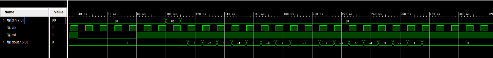
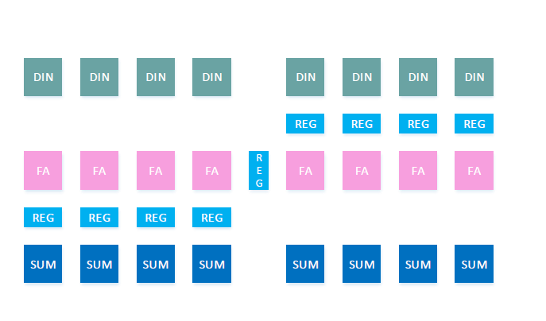
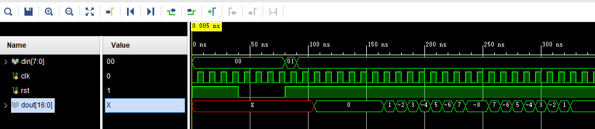

# Introduction
In this lab you are required to design a linear-phase 15-stage FIR filter.\
If you have problem with what is FIR filter, you can reference\
<https://www.cnblogs.com/alifpga/p/7902759.html>\
<https://blog.csdn.net/Reborn_Lee/article/details/82891161>

# Declaration of the top-level
Please use the entity declaration as below：
```Verilog
module FIR(
input [7:0] din,
input clk,
input rst,
output signed [16:0] dout
);
parameter signed [4:0] h0 = 5'd1;
parameter signed [4:0] h1 = -5'd2;
parameter signed [4:0] h2 = 5'd3;
parameter signed [4:0] h3 = -5'd4;
parameter signed [4:0] h4 = 5'd5;
parameter signed [4:0] h5 = -5'd6;
parameter signed [4:0] h6 = 5'd7;
parameter signed [4:0] h7 = -5'd8;
```
You should use the given parameter.
# Requirements
In this lab, you do not have to test the code on board, just use the given testbench and generate the right waveform. You can get the testbench at [<src/fir15_tb.v>](<src/fir15_tb.v>)
## FIR Filter
\
## MultiCycle Adder
The following code shows the traditional ripple carry adder
```Verilog
module FA(
input Ci,input A,input B,
output S,output Co
);
assign {Co,S}=A+B+Ci;
endmodule

module HA(
input A,input B,
output S,output Co
);
assign {Co,S}=A+B;
endmodule

module FA4(
input Ci,
input [3:0] A,
input [3:0] B,
output [3:0] S,
output Co
);
wire [3:0] P;
wire [3:0] C;
wire BP;
assign P[0]=A[0] ^ B[0];
assign P[1]=A[1] ^ B[1];
assign P[2]=A[2] ^ B[2];
assign P[3]=A[3] ^ B[3];
assign BP=P[0]&P[1]&P[2]&P[3];
FA FA_0(Ci,A[0],B[0],S[0],C[0]);
FA FA_1(C[0],A[1],B[1],S[1],C[1]);
FA FA_2(C[1],A[2],B[2],S[2],C[2]);
FA FA_3(C[2],A[3],B[3],S[3],C[3]);
assign Co = BP ? Ci:C[3];
endmodule
```
You can add registers between the datapath of traditional ripple carry adder and reduce the critical path delay. This time, you should combine your multi-cycle adder with your FIR filter. 



## FIR Filter with MultiCycle Adder
\

# Submit
+ You should submit:
    1. Code of FIR filter.
    2. Code of multi-cycle adder.
    3. Screenshot of your waveform.
+ All the pictures should be packaged in a pdf file. All of these files should be compressed in zip format and renamed as this: 

        ECE_GY_6483.HW3.[Name].[ID].zip

+ For example, the zip file name is: 

        ECE_GY_6483.HW3.XinzheLiu.N12209886.zip

+ File Organization Schema in Package:

        EE216_HW3_[Name][ID].zip
        ├─ FIR.v
        └─ MultiCycleAdder.v
        └─ picture.pdf

+ Submit method
	1. Send an email to TA (xinzhe.liu@nyu.edu) with the compressed package as an attachment.
	2. The title of email **MUST** start with "[ECE-GY 6483][HW3]". For example: "[ECE-GY 6483][HW3] Submission from Liu Xin'zhe."

+ Deadline
	1. Deadline at 6 pm on October 20, 2021.
	2. Late submission within 48 hours will only get 80% of the score for this homework. For example, if your score for this homework is 80, then only 64 will be entered into the total score.
	3. All points will be lost if you are late for more than 48 hours.
