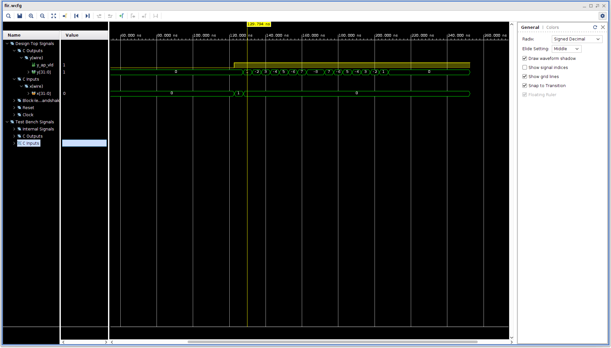

## Introduction
Finite Impulse Response (FIR) filters are commonplace in digital signal processing (DSP) applications -- they are perhaps the most widely used operation in this domain. They are well suited for hardware implementation since they can be implemented as a highly optimized architecture. A key property is that they are a linear transform on contiguous elements of a signal. This maps well to data structures (e.g., FIFOs or tap delay lines) that can be implemented efficiently in hardware. In this lab, you are going to optimize the throughput of an FIR filter written in HLS C. 
## Declaration of the top-level

```c
#define N 16

typedef int coef_t;
typedef int data_t;
typedef int acc_t;

void fir(data_t *y, data_t x) {
    coef_t c[N] = {1,-2,3,-4,5,-6,7,-8,-8,7,-6,5,-4,3,-2,1};
	static data_t shift_reg[N];
	acc_t acc;
	int i;

	acc = 0;

	for (i = N - 1; i >= 0; i--) {

		if (i == 0) {
			acc += x * c[0];
			shift_reg[0] = x;
		} else {
			shift_reg[i] = shift_reg[i - 1];
			acc += shift_reg[i] * c[i];
		}
	}
	*y = acc;
}

```
The code given above is a functionally correct, but highly unoptimized implementation of a 15 tap FIR filter. The performance and utilization estimates are given below.
```
== Performance Estimates
+-----+-----+-----+-----+---------+
|  Latency  |  Interval | Pipeline|
| min | max | min | max |   Type  |
+-----+-----+-----+-----+---------+
|   49|   65|   49|   65|   none  |
+-----+-----+-----+-----+---------+
== Utilization Estimates
+-----------------+---------+-------+--------+--------+-----+
|       Name      | BRAM_18K| DSP48E|   FF   |   LUT  | URAM|
+-----------------+---------+-------+--------+--------+-----+
|DSP              |        -|      -|       -|       -|    -|
|Expression       |        -|      0|       0|      85|    -|
|FIFO             |        -|      -|       -|       -|    -|
|Instance         |        -|      -|       -|       -|    -|
|Memory           |        0|      -|      68|       9|    0|
|Multiplexer      |        -|      -|       -|     111|    -|
|Register         |        -|      -|     148|       -|    -|
+-----------------+---------+-------+--------+--------+-----+
|Total            |        0|      0|     216|     205|    0|
+-----------------+---------+-------+--------+--------+-----+
|Available        |     1824|   2520|  548160|  274080|    0|
+-----------------+---------+-------+--------+--------+-----+
|Utilization (%)  |        0|      0|   ~0   |   ~0   |    0|
+-----------------+---------+-------+--------+--------+-----+
```
 In this homework, you are required to:
1. Write a testbench for the function. The testbench should generate an impulse whose amplitude is one. Besides, you should generate a golden result to ensure the functionality of your optimized FIR filter is correct.
2. Try to optimize the performance of the FIR filter, which is measured by the interval. Besides, you should choose the zcu102 board and set the frequency to 200MHz when creating a project. 
3. Perform Co-Simulation and generate the waveform.

Here is an example, after optimization, the performance is greatly improved, both latency and interval are reduced to 1 but the utilization is also greatly increased.
```
== Performance Estimates
+-----+-----+-----+-----+---------+
|  Latency  |  Interval | Pipeline|
| min | max | min | max |   Type  |
+-----+-----+-----+-----+---------+
|    1|    1|    1|    1|   none  |
+-----+-----+-----+-----+---------+
== Utilization Estimates
+-----------------+---------+-------+--------+--------+-----+
|       Name      | BRAM_18K| DSP48E|   FF   |   LUT  | URAM|
+-----------------+---------+-------+--------+--------+-----+
|DSP              |        -|      -|       -|       -|    -|
|Expression       |        -|      -|       0|     789|    -|
|FIFO             |        -|      -|       -|       -|    -|
|Instance         |        -|      -|       -|       -|    -|
|Memory           |        -|      -|       -|       -|    -|
|Multiplexer      |        -|      -|       -|       -|    -|
|Register         |        -|      -|     738|       -|    -|
+-----------------+---------+-------+--------+--------+-----+
|Total            |        0|      0|     738|     789|    0|
+-----------------+---------+-------+--------+--------+-----+
|Available        |     1824|   2520|  548160|  274080|    0|
+-----------------+---------+-------+--------+--------+-----+
|Utilization (%)  |        0|      0|   ~0   |   ~0   |    0|
+-----------------+---------+-------+--------+--------+-----+
```
you can see from the waveform that the input of the FIR is an impulse, and the output is generated 1 cycle behind the input signal. 


## Submit
+ You should submit:
	1. Code of the FIR filter.
	2. Code of the testbench.
	3. The generated waveform file.
	4. Screenshot of the result of C-Simulation, Synthesis, and Co-Simulation.
	5. A PDF report describing your optimizing method.
	
+ All the pictures should be packaged in a pdf file. All of these files should be compressed in zip format and renamed as this: 

		ECE_GY_6483.HW4.[Name].[ID].zip	

+ For example, the zip file name is: 

        ECE_GY_6483.HW4.XinzheLiu.N12209886.zip

+ File Organization Schema in Package:

		EE216_HW4_[Name][ID].zip\
		├─ FIR.c\
		└─ FIR_tb.c\
		└─ Report.pdf\
		└─ Waveform.wcfg

+ Submit method
	1. Send an email to TA (xinzhe.liu@nyu.edu) with the compressed package as an attachment.
	2. The title of email **MUST** start with "[ECE-GY 6483][HW4]". For example: "[ECE-GY 6483][HW4] Submission from Liu Xin'zhe."

+ Deadline
	1. Deadline at 6 pm on November 24, 2021.
	2. Late submission within 48 hours will only get 80% of the score for this homework. For example, if your score for this homework is 80, then only 64 will be entered into the total score.
	3. All points will be lost if you are late for more than 48 hours.