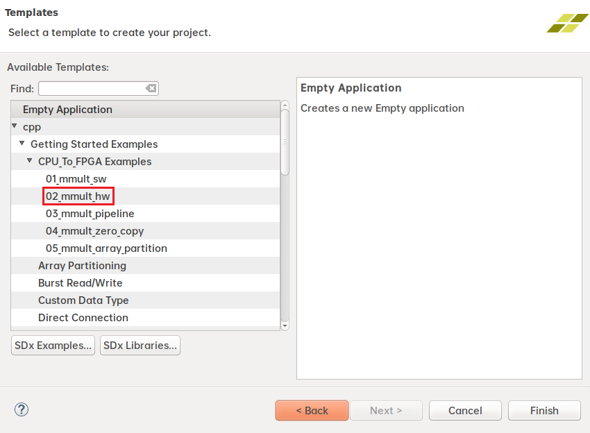

# Optimize Huge Dimension Matrix Multiplication
## Description
In [T5](T5.md), we introduced the usage of SDSoC using matrix multiplication as examle. However, the dimension of the matrix is only 32, which is not so sufficient in realistic applications. In this lab, you are required to optimize matrix multiplication with huge dimension(1024). 
## Declaration of the top-level
In this lab, we are going to use the provided sample code as a baseline.



If you change the DATASIZE directly to 1024 without any modification, 
```cpp
#define DATA_SIZE 1024
```
you will get
```
ERROR: [PerfEst 83-2235] Hardware function 'mmult_hw' array argument 'in1' has 1048576 elements, which exceeds the maximum supported BRAM depth of 16384.
ERROR: [PerfEst 83-2235] You can use '#pragma SDS data access_pattern(in1:SEQUENTIAL)' to map this argument to a FIFO interface.
ERROR: [PerfEst 83-2239] failed to create xd_adapter for accelerator comp mmult_hw_1
/opt/Xilinx/SDx/2019.1/bin/perf_est: line 11: 10887 Segmentation fault      (core dumped) ${BIN_DIR}/unwrapped/lnx64.o/`basename ${LOADER}` ${ARGS}
```
Thus, modify the code to support 1024*1024 matrix multiplication. You can do any modification to 

## Requirements
In this lab, you are required to
1. Design a matrix multiplier in SDSoC that support 1024*1024 matrix multiplication.
2. Guarantee your codes generate the right output. 
3. Try to optimize the system throughput, which is measured by the total cpu cycle counts. (Optional)
4. For [main.cpp](src/HW5/src/main.cpp), You can only add or modify code between **hw_ctr.start();** and **hw_ctr.stop();**.
4. Record the problems you encountered as well as the effort to optimize the performance.
5. Select zcu104 when creating project whose name **MUST** be your student ID.

## Submit
HW5 does not need to be submitted.