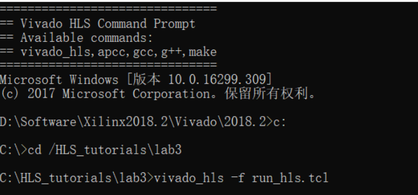
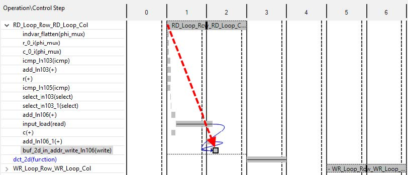
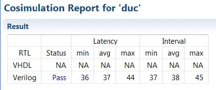

# High-Level Synthesis Tutorial

## Overview
The tutorial shows how use of optimization directives transforms an initial RTL implementation into both a low-area and high-throughput implementation.

### Lab1: Set up a High-Level Synthesis (HLS) project
Explains how to set up a High-Level Synthesis (HLS) project and perform all the major steps
in the HLS design flow:
- Validate the C code.
- Create and synthesize a solution.
- Verify the RTL and package the IP.

### Lab2: Using Solutions for Design Optimization
Shows you how to optimize the design using optimization directives. This lab creates multiple versions of the RTL implementation and compares the different solutions.

### Lab3: Basic operations of the HLS C debug environment.
Reviews the aspects of a good C test bench, the basic operations for C validation and the C
debugger.

### Lab4: Use analysis perspective to drive design optimization.
Synthesize and analyze a DCT design. Use the insights from the design analysis to apply
optimizations and judge the effectiveness of the optimization.

### Lab5: RTL Verification
The High Level Synthesis tool automates the process of RTL verification and allows you to use RTL verification to generate trace files that show the activity of the waveforms in the RTL design. You can use these waveforms to analyze and understand the RTL output. 

---
**IMPORTANT**: The source code of all the tutorial examples for Vivado High-Level Synthesis are available at **src/T2_HLS_intro** .
By the way, the labs are extracted from xilinx doc ug871(https://china.xilinx.com/support/documentation/sw_manuals/xilinx2019_1/ug871-vivado-high-level-synthesis-tutorial.pdf) at
- CH2.1: Creating a High-Level Synthesis Project
- CH2.3: Using Solutions for Design Optimization
- CH3.1: C Validation and Debug
- CH6.1: Design Optimization of DCT
- CH8: RTL Verification

You can find more details in ug871.

---
## Lab1: Set up a HLS project
This lab shows how to create a High-Level Synthesis project, validate the C code, synthesize the design to RTL, and verify the RTL.
**IMPORTANT**: The figures and commands in this tutorial assume the tutorial data directory Vivado_HLS_Tutorial files are unzipped and placed in the location C:\Vivado_HLS_Tutorial.

#### Step1: Creating a New Project
1. Open the Vivado® HLS Graphical User Interface (GUI):
  - On Windows systems, open Vivado HLS by double-clicking the Vivado HLS 2019.1 desktop icon.
  - On Linux systems, type  **vivado_hls**  at the command prompt.

**TIP**: You can also open Vivado HLS using the Windows menu Start > All Programs > Xilinx Design Tools > Vivado 2019.1 > Vivado HLS > Vivado HLS 2019.1.

2. In the Welcome Page, select  **Create New Project**  to open the Project wizard.
3. 
    - Enter the project name *fir_prj*.
    - Click Browse to navigate to the location of the *lab1*  (Introduction) directory. 【You can select any empty directory as you like.】
    - Select the *lab1*  directory and click **OK**.
    - Clickb **Next**.


4. Enter the following information to specify the C design files:
    - Click **Add Files**.
    - Select *fir.c*  and click **OK**. 【The file is in **src/T2_HLS_intro/lab1**】
    - Use **Browse** button to specify *fir.c* as the top-level function.
    - Click **Next**.
    

5. Click the **Add Files** button to include both test bench files: **fir_test.c** and **out.gold.dat** . And then click **Next**.
    

6. The Solution Configuration window  specifies the technical specifications of the first solution.
 
    -  Accept the default solution name (solution1), clock period (10 ns), and clock uncertainty (defaults to 12.5% of the clock period, when left blank/undefined).
    - Click the **part** selection button to open the part selection window. Select the **Boards** tab and select **Zynq UltraScale+ZCU102 Eveluation Board** 
   

7. Click **Finish** to open the Vivado HLS project. The following figure is important during next steps.
    

#### Step2: Validate the C Source Code
The first step in an HLS project is to confirm that the C code is correct. This process is called **C Validation** or **C Simulation**.
In this project, the test bench compares the output data from the fir function with known good values.

1. Expand the **Test Bench folder** in the Explorer pane. Double-click the file **fir_test.c** to view it in the Information pane. In the Auxiliary pane, select **main()** in the Outline tab to jump directly to the main() function.
  

The Vivado HLS tool can reuse the C test bench to perform verification of the RTL.
  - If the test bench has the previously described self-checking characteristics, the RTL results are automatically checked during RTL verification. Vivado HLS re-uses the test bench during RTL verification and confirms the successful verification of the RTL if the test bench returns a value of 0. If any other value is returned by main(), including no return value, it indicates that the RTL verification failed. There is no requirement to create an RTL test bench. This provides a robust and productive verification methodology.

2. Click the **Run C Simulation** button, or use menu **Project > Run C Simulation**, to compile and execute the C design.
3. In the C Simulation dialog box, click **OK**.
The Console pane confirms the simulation executed successfully.
  


#### Step3: High-Level Synthesis
1. Click the **Run C Synthesis** toolbar button or use the menu **Solution > Run C Synthesis > Active Solution**.
When synthesis completes, the report file opens automatically. Because the synthesis report is open in the Information pane, the Outline tab in the Auxiliary pane automatically updates to reflect the report information.

2. Click **Performance Estimates** in the Outline tab. In the Detail section of the Performance Estimates, expand the Loop view.
  
In the Summary section, you can see:
- The design has a latency of 34-clock cycles: it takes 34 clocks to output the results.
- The interval is 34 clock cycles: the next set of inputs is read after 34 clocks. The design is not pipelined. The next execution of this function (or next transaction) can only start when the current transaction completes.

3. In the Outline tab, click **Utilization Estimates**
  

 4. In the Detail section of the Utilization Estimates, expand the Expression view.

 5. In the Outline tab, click **Interface**
     

#### Step4: RTL Verification
High-Level Synthesis can re-use the C test bench to verify the RTL using simulation
1. Click the **Run C/RTL CoSimulation** toolbar button or use the menu **Solution > Run C/RTL CoSimulation**.
2. Click **OK** in the C/RTL Co-simulation dialog box to execute the RTL simulation.
   


#### Step5: IP Creation
The final step in the High-Level Synthesis flow is to package the design as an IP block for use with other tools in the Vivado Design Suite.
1. Click the **Export RTL** toolbar button or use the menu **Solution > Export RTL**.
2. Ensure the Format Selection drop-down menu shows **IP Catalog**.
3. Click **OK**.
The IP packager creates a package for the Vivado IP Catalog. (Other options available from the drop-down menu allow you to create IP packages for System Generator for DSP, a Synthesized Checkpoint format for Vivado, or a Pcore for Xilinx Platform Studio.)
4. Expand **Solution1** in the Explorer.
5. Expand the impl folder created by the Export RTL command.
6. Expand the ip folder and find the IP packaged as a zip file, ready for adding to the Vivado IP Catalog
  

 At this stage, leave the Vivado HLS GUI open. You will return to this in the next lab exercise.

---
 ### Lab2: Using Solutions for Design Optimization
This lab exercise uses the design from Lab 1 and optimizes it.

#### Step1: open the lab1 project.
I hope you didn't close the lab1 project. If you did, open it again.
  

#### Step2: Optimize the I/O Interfaces.
You can review the I/O protocol in synthesis report again by navigating to the report folder inside the **solution1\syn\report** folder.
The I/O requirements are:
- Port C must have a single port RAM access.
- Port X must have an input data valid signal.
- Port Y must have an output data valid signal.

Port C already is a single-port RAM access. However, if you do not explicitly specify the RAM access type, High-Level Synthesis might use a dual-port interface. HLS takes this action if doing so creates a design with a higher throughput. If a single-port is required, you should explicitly add to the design the I/O protocol requirement to use a single-port RAM.

Input Port X is by default a simple 32-bit data port. You can implement it as an input data port with an associated data valid signal by specifying the I/O protocol **ap_vld**.

Output Port Y already has an associated output valid  signal. This is the default for pointer arguments. You do not have to specify an explicit port protocol for this port, because the default implementation is what is required, but if it is a requirement, it is a good practice to specify it.

To preserve the existing results, create a new solution, solution2.
1. Click **Project > New Solution** toolbar button to create a new solution.
2. Leave the default solution name as solution2. Do not change any of the technology or clock settings. Select **ZCU102** in the Part Selection.
3. Click **Finish**.
   

To add optimization directives to define the desired I/O interfaces to the solution, perform the following steps.
4. In the Explorer pane, expand the **Source** container.
5. Double-click *fir.c* to open the file in the Information pane.
6. Activate the **Directive** tab in the Auxiliary pane and select the top-level function **fir** to jump to the top of the fir function in the source code view.
   

Then apply the optimization directives to the design.

7. In the Directive tab, select the **c** argument/port (green dot).
8. Right-click and select **Insert Directive**.
9. Implement the single-port RAM interface by performing the following:
    - Select **RESOURCE** from the Directive drop-down menu.
    - Click the **core** box.
    - Select **RAM_1P_BRAM**, Then select OK.
     

10. In the **Destination** section of the **Directive Editor**, select **Source File**. 【you can see a new line with #pragma in fir.c file】
11. To apply the directive, click OK.

**TIP**: If you wish to change the destination of any directive, double-click on the directive In the Directive tab and modify the destination.

12. Specify port x to have an associated valid signal/port.
a. In the **Directive** tab, select input port **x** (green dot).
b. Right-click and select **Insert Directive**.
c. Select **Interface** from the Directive drop-down menu.
d. Select **Source File** from the **Destination** section of the dialog box.
e. Select **ap_vld** as the mode.
f. Click **OK** to apply the directive.
13. Specify port y to have an associated valid signal/port.[Similar operations to x]

When complete, verify that the source code and the Directive tab are correct as shown in following figure. Right-click on any incorrect
   
[Maybe on the **Directive tab**, the shift_reg varaiable is above the Shift_Accum_Loop which is also correct.]

14. Click the **Run C Synthesis** toolbar button to synthesize the design.
15. When prompted, click **Yes** to save the contents of the C source file. Adding the directives as pragmas modified the source code.

When synthesis completes, the report file opens automatically.

16. Click the **Outline** tab to view the **Interface** results, or simply scroll down to the bottom of the report file.

You can see the ports now have the correct I/O protocols.

#### Step3: Analyze the Results
Before optimizing the design, it is important to understand the current design. It was shown in Lab 1 how the synthesis report can be used to understand the implementation. However, the Analysis perspective provides greater detail in an inter-active manner.

1. Click the **Analysis** perspective button.[At the top right of hls GUI. In the right of systhesize tab.]
2. Click the **Shift_Accum_Loop** in the **Schedule Viewer** window to expand it.
   

Some of the objects here correlate directly with the C source code. Right-click the object to cross-reference with the C code. [example: **icmp_ln64(icmp)**].

- The design starts in the first state with a read operation on port x.
- In the next state, it starts to execute the logic created by the for-loop *Shift_Accum_Loop*. Loops are shown in grey, and you can expand or collapse them.
- In the first state, the loop iteration counter is checked: addition, comparison, and a potential loop exit.
- There is a one-cycle memory read operation on the block RAM synthesized from array data.
- There is a memory read on the c port.
- The multiplication operation takes 1 cycles to complete.
 The for-loop is executed 11 times.
- At the end of the final iteration, the loop exits in Control Step 1 and the write to port y occurs.


You can also use the Analysis perspective to analyze the resources used in the design.
3. Click the **Resource viewer**, Expand all the resource groups.
   

- There is a read on port x and a write to port y. Port c is reported in the memory section
because this is also a memory access (the memory is outside the design).
- There is a single pipelined multiplier used in this design.
- One of the adders is being shared: there are two instances of the adder on one row.

With the insight gained through analysis, you can proceed to optimize the design.

#### Step4: Optimize for the Highest Throughput (Lowest Interval)
The two issues that limit the throughput in this design are:
- The for loop. By default loops are kept rolled: one copy of the loop body is synthesized and re-used for each iteration. This ensures each iteration of the loop is executed sequentially. You can unroll the for loop to allow all operations to occur in parallel.
- The block RAM used for shift_reg. Because the variable shift_reg is an array in the C source code, it is implemented as a block RAM by default. However, this prevents its implementation as a shift-register. You should therefore partition this block RAM into individual registers.

1. Click the **Synthesis perspective** button.
2. Create a new solution **solution3**
   

3. In the Project menu, select **Close Inactive Solution Tabs** to close any existing tabs from previous solutions.

The following Figure explain how to unroll the loop.
   

4. Click in the *fir.c* file, then in the **Directive tab**, select loop **Shift_Accum_Loop**.
5. Right-click and select **Insert Directive**.
6. From the Directive drop-down menu, select **Unroll**. Leave the other options in the Directives window unchecked and blank to ensure that the loop is fully unrolled.

Leave the Destination as the **Directive File**.
When optimizing a design, you must often perform multiple iterations of optimizations to determine what the final optimization should be. By adding the optimizations to the directive file, you can ensure they are not automatically carried forward to the next solution.
Storing the optimizations in the solution directive file allows different solutions to have different optimizations. If you added the optimizations as pragmas in the code, they would be automatically carried forward to new solutions, and you would have to modify the code to go back and re-run a previous solution.

7. Click **OK** to apply the directive.
8. Apply the directive to partition the array into individual elements.
  a. In the Directive tab, select array **shift_reg**.
  b. Right-click and select **Insert Directive**.
  c. Select **Array_Partition** from the Directive drop-down menu.
  d. Specify the type as **complete**.
  e. Select **OK** to apply the directive.

With the directives embedded in the code from solution2 and the two new directives just added, the directive pane for solution3 appears as
   

9. In the Explorer pane, expand the **Constraint** folder in **Solution3**, Double-click the solution3 **directives.tcl** file to open it in the Information pane.
   

10. Click the **Synthesis** toolbar button to synthesize the design.
When synthesis completes, the synthesis report automatically opens.
11. Compare the results of the different solutions. Click the **Compare Reports** toolbar button.
Alternatively, use **Project > Compare Reports**.
12. Add solution1, solution2, and solution3 to the comparison.
13. Click **OK**.

   

solution3 has the smallest initiation interval and can process data much faster. As the interval is only 11, it starts to process a new set of inputs every 11 clock cycles.

It is possible to perform additional optimizations on this design. For example, you could use **pipelining** to further improve the throughput and lower the interval in lab4. Moreover, you could modify the code itself to use arbitrary precision types with fixed point.

---
### Lab3: Basic operations of the HLS C debug environment.
This exercise reviews the aspects of a good C test bench and explains the basic operations of the High-Level Synthesis C debug environment.

#### Step 1: Create and Open the Project
1. Open the Vivado HLS Command Prompt.
    - On Windows use **Start > All Programs > Xilinx Design Tools > Vivado 2019.2 > Vivado HLS > Vivado HLS 2019.2 Command Prompt.**
    - On Linux, open a new shell.
2. Using the command prompt window, change the directory to the **src/T2_HLS_intro/lab3**.
3. Execute the Tcl script to setup the Vivado HLS project, using the command  
```
vivado_hls -f run_hls.tcl
```
   
4. When Vivado HLS completes, open the project in the Vivado HLS GUI using the command 
```
vivado_hls -p hamming_window_prj
```
【**Tip:** If you close the Command Promt, the vivado will be closed.】

#### Step 2: Review Test Bench and Run C Simulation
1. Open the C test bench for review by double-clicking *hamming_window_test.c* in the Test Bench folder.

A review of the test bench source code shows the following good practices:
- The test bench:
    - Creates a set of expected results that confirm the function is correct.
    - Stores the results in array sw_result.
- The Design Under Test (DUT) is called to generate results, which are stored in array *hw_result*. Because the synthesized functions use the *hw_result* array, it is this array that holds the RTL-generated results later in the design flow.
- The actual and expected results are compared. If the comparison fails, the value of variable err_cnt is set to a non-zero value.
- The test bench issues a message to the console if the comparison failed, but more importantly returns the results of the comparison. If the return value is zero the test bench validates the results are good.

This process of checking the results and returning a value of zero if they are correct **automates RTL verification**.

2. Click the Run C Simulation toolbar button to open the C Simulation Dialog box. Select OK to run the C simulation. The simulation output is shown in the Console window.
    - Any print statements in the C code are echoed in the Console window. This example shows the simulation passed correctly.
    - The C simulation executes in the solution subdirectory **csim**. You can find any output from the C simulation in the **build** folder.
    - Because the C simulation is not executed in the project directory, you must add any data files to the project as C test bench files (so they can be copied to the csim/build directory when the simulation runs). Such files would include, for example, input data read by the test bench.
     

#### Step 3: Run the C Debugger
A C debugger is included as part of High-Level Synthesis. You need to make sure your code can run correctly before synthesized.
1. Click the Run C Simulation toolbar button to open the C Simulation Dialog box.
2. Select the Launch Debugger option, Click OK to run the simulation.
 

The Launch Debugger option compiles the C code and then opens the Debug environment.
 
Before proceeding, note the following:
- Highlighted at the top-right in Figure 3-7, you can see that the perspective has changed from Synthesis to Debug. Click the perspective buttons to return to the synthesis environment at any time.
- By default, the code compiles in debug mode. The Launch Debugger option
automatically opens the debug perspective at time 0, ready for debug to begin. To compile the code without debug information, select the Optimizing Compile option in the C Simulation dialog box.
- You can use the Step Into button to step through the code line-by-line.

 

3. Expand the Variables window to see the sw_result array. Then expand the sw_result array.
 

4. Click the **Step Into** button (or key F5) repeatedly until you see the values being updated in the Variables window.

In this manner, you can analyze the C code and debug it if the behavior is incorrect.
For more detailed analysis, to the right of the Step Into button are the Step Over (F6), Step Return (F7) and the Resume (F8) buttons.

5. Scroll to line 69 in the hamming_window_test.c file.
6. Place the cursor in the left-hand margin on line 69, right-click with the mouse button and select **Toggle Breakpoint**. A breakpoint (blue dot) is indicated in the margin.
 

7. Activate the Breakpoints tab, to confirm there is a breakpoint set at line 69.
8. Click the Resume button (highlighted in Figure 3-10) or the F8 key to execute up to the breakpoint.

9. Click the **Step Into** button (or key F5) multiple times to step into the *hamming_window* function.
10. Click the **Step Return** button (or key F7) to return to the main function.
11. Click the red **Terminate** button to end the debug session.
You can use the Run C simulation button to restart the debug session from within the Debug perspective.
12. Exit the Vivado HLS GUI and return to the command prompt.

---
### Lab4: Use analysis perspective to drive design optimization.
To create a high performance RTL implementation from C,C++, we need to analyse the results and apply the optimization directives repeatly. A key part of this process is the analysis of the results. This lab explains how to use the reports and the GUI Analysis perspective to analyze the design and determine which optimizations to apply.

The sample designs used in the lab exercise is a 2-D DCT function. To highlight the design analysis feature, your goal is to have this design operate with an interval of 125 or less. The design should be able to process a new set of input data at least every 125 clock cycles.

#### Step 1: Create and Open the Project
Similar to lab3, create and open the project first.
1. Open the Vivado HLS Command Prompt.
    - On Windows click Start > All Programs > Xilinx Design Tools > Vivado 2019.2 > Vivado HLS > Vivado HLS 2019.2 Command Prompt.
    - On Linux, open a new shell.
2. Using the command prompt window , change the directory to the **src/T2_HLS_intro/lab4**.
3. Execute the Tcl script to setup the Vivado HLS project, using the command 
```
vivado_hls -f run_hls.tcl
```
4. When Vivado HLS completes, open the project in the Vivado HLS GUI using the command 
```
vivado_hls -p dct_prj
```

#### Step 2: Review the Source Code and Create the Initial Design
1. Double-click the file dct.cpp in the Source folder to open the source code for review.
This example uses a DCT function. Following Figure shows an overview of this code.
 

- The left side of the figure shows the code hierarchy.
    - Top-level function dct has three sub-functions: read_data, dct_2d and write_data.
    - Function dct_2d has a single sub-function dct_1d.
- The center of the figure shows loops inside each of the functions.
- The right side of the figure shows the how the data is processed through the functions and loops.
    - The read_data function executes, and the data is processed through loop RD_Loop_Row, which has a sub-loop RD_Loop_Col.
    - After the read_data function completes, function dct_2d executes.
    -In function dct_2d, Row_DCT_Loop processes the data. Row_DCT_Loop has two nested loops inside it: DCT_output_loop and DCT_inner_loop.
    - DCT_inner_loop calls function dct_1d.
And so on, until the function write_data processes the data.

2. Click the **Run C Synthesis** toolbar button to synthesize the design to RTL.

#### Step 3: Review the Performance Using the Synthesis Report
When synthesis completes, the synthesis report opens automatically.
 

You can obtain the following information:
- The clock frequency of 8 ns has been met.
- The top-level design takes 2935 clock cycles to write all the outputs.
- You can apply new inputs after 2935 clock cycles. This immediately reveals that the design is not pipelined, but this fact is also noted in the report: type is set to none and not pipelined.
- The top level has a single instance, which has a latency and initiation interval of 2644.
    - This block also has no pipelining and accounts for most of the clock cycles.
- Notice that the functions read_data and write_data are not noted here as instances of the top level.
    - During synthesis, these blocks were automatically inlined (the hierarchy was removed).
 
    - High-level synthesis might automatically inline small functions to improve the quality of results (QoR). You can prevent this by adding the Inline directive with the *-off* option to any function being automatically inlined.
- The loops in the read_data and write_data functions are therefore implemented at the top level and are reported as loops in the top-level function.
- Each loop has a latency of 144 clock cycles. (Because the loops are not pipelined, there
is no initiation interval.)
- Using RD_Loop_Row as an example, you can see why the loop latency is 144.
    - Sub-loop RD_Loop_Col has a latency of 2 cycles for each iteration of the loop (iteration latency) and a tripcount of 8: 2 x 8 = 16 clock cycles total latency for the loop.
    - From RD_Loop_Row, it takes 1 clock to enter loop RD_Loop_Col and 1 clock cycle to return to RD_Loop_Row. The iteration latency for RD_Loop_Row is therefore (1 + 16 +1) 18 clock cycles.
    - RD_Loop_Row has a tripcount of 8 so the total loop latency is 8 x 18 = 144 clock
cycles.
- The total latency of 2935 cycles for the dct block is therefore:
    - 144 clocks for the RD_Loop_Row block.
    - Plus 2644 clock cycles for the dct_2d block.
    - Plus 144 clock cycles for WR_Loop_Row.
    - Plus a clock cycle to enter each of those three blocks.

To review the details of the instantiated sub-blocks dct_2d and dct_1d, open their respective reports from the syn/report folder under solution1 in the Explorer pane.
You can also use the design analysis perspective to review these details in a more interactive manner.

#### Step 4: Review the Performance Using the Analysis Perspective
Invoke the Analysis perspective any time after synthesis completes.

1. Click the **Analysis perspective** button to begin interactive design analysis.
 

2. Click loop RD_Loop_Row to expand the loop hierarchy.
 
- This view shows how the operations in this loop are scheduled into steps.
- From this, you can see that in the first step (S1) of the RD_Loop_Row, the loop exit condition is checked and an add operation performed. This addition is likely the counter for
the loop iterations. Generally we can confirm it by selecting the adder in step S1, right-click and select **Go to Source**. You an obtain the desired result as the figure shows. But maybe your highlight line is 101, donot worry, ignore it.Just remember the **Go to Source** operation. Sometimes HLS GUI may go to the nearby source, you need to do a little analysis. 
 

3. In the **Module Hierarchy** pane, click the function **dct_2d** to navigate into the view for this function。
 
You can pipeline the loops to improve the performance. The details in the Performance Profile show that most of the latency is caused by loops Row_DCT_Loop and Col_DCT_Loop.

4. In the **Module Hierarchy**, click function *dct_2d* to navigate into the view for this function. Expand the loops in the **Performance Profile** . 【If you can't see anything in **Performance Profile** , click the function *dct_2d* again.】
 
you can see a series of nested loops (Row_DCT_loop, Col_DCT_Loop) that can be pipelined. Pipelining the function unrolls all the loops within it, and thus greatly increases the area. If
the objective is to get the highest possible performance with no regard for area, this may be the best optimization to perform.

5. Click the Synthesis perspective button to return to the main synthesis view.

#### Step 5: Apply Loop Pipelining and Review for Loop Optimization
In this step, you create a new solution and add pipelining directives to the loops. When pipelining nested loops, it is generally best to pipeline the inner-most loop.

1. Select the **New Solution** toolbar button or use the menu **Project > New Solution** to create a new solution.
2. Click **Finish** and accept the defaults.
3. Ensure that you can see the C source code (*dct.cpp*) in the Information pane.
4. In the Directive tab, add a pipeline directive to loop **DCT_Inner_Loop** in function *dct_1d*.
a. Right-click **DCT_Inner_Loop** in the Directive pane and select **Insert Directive**.
b. In the Directive Editor dialog box activate the Directive drop-down menu at the top and select **PIPELINE**.
c. Click **OK** to select the default maximum pipeline rate (II=1).

5. Repeat step 4 for the following loops:
a. In function *dct_2d* loop *Xpose_Row_Inner_Loop*
b. In function *dct_2d loop *Xpose_Col_Inner_Loop*
c. In function *read_data loop *RD_Loop_Col*
d. In function *write_data* loop *WR_Loop_Col*

The Directive pane shows the following (highlighted) optimization directives applied.
 

6. Click the **Run C Synthesis** toolbar button to synthesize the design to RTL. If a file was modified, please select **YES**.
7. When synthesis completes, use the **Compare Reports** toolbar button or the menu **Project > Compare Reports** to compare solutions 1 and 2.

You can see that pipelining the loops has improved the latency of the design with an almost 50% reduction in solution2. Pipelining loops transforms the latency from Latency1 = iteration latency * (tripcount * interval) to Latency2 = iteration latency + (tripcount * interval).

Next, you once again open the Analysis perspective, analyze the results, and determine whether or not there are more opportunities to for optimization.

8. Click the **Analysis perspective** button to begin interactive design analysis. In the Module Hierarchy, click function **dct_2d** to navigate into the view for this function.

In the Performance Profile you can see that the latency of all the loops has been substantially reduced (Row_DCT_Loop and Col_DCT_loop have been approximately halved from the earlier report.  However, the majority of the latency is still due to these two loops, each of which calls the *dct_1d* block.

#### Step 6: Apply Loop Pipelining and Review for Loop Optimization
1. Select the **New Solution** toolbar button or use the menu **Project > New Solution** to create a new solution.
2. Click **Finish** and accept the defaults to create solution3.
3. Ensure the C source code is visible in the Information pane.
4. In the **Directive** tab
a. In function **dct_1d**, select the pipeline directive on loop DCT_Inner_Loop.
b. Right-Click and select **Remove Directive**.
c. Still in function dct_1d, select loop **DCT_Outer_Loop**.
d. Right-click and select **Insert Directive**.
e. In the **Directive Editor** dialog box activate the **Directive** drop-down menu at the top and select **PIPELINE**.
f. Click **OK** to select the default maximum pipeline rate (II=1).
The Directive pane should show the following (highlighted) optimization directives applied.

 

5. Click the **Run C Synthesis** toolbar button to synthesize the design to RTL.
6. When synthesis completes, click the **Compare Reports** toolbar button to compare solutions 2 and 3.

 
The significant latency benefit is achieved because multiple loops in the design call the dct_1d function multiple times. Saving latency in this block is multiplied because this function is used inside many loops.

Now that all the loops are pipelined, it is worthwhile to review the design to see if there are performance-limiting “bottlenecks.” Bottlenecks are limitations in the flow of data that can prevent the logic blocks from working at their maximum data rate.

Such limitations in the data flow can come from a number of sources,for example, I/O ports and arrays implemented as block RAM. In both cases, the finite number of ports (on the I/O or block RAM) limits the rate at which data can be read or written.
Another source of bottlenecks is data dependencies in the original source code. In some cases, these data dependencies are inherent in how the algorithm operates, as when a calculation cannot be performed until an earlier calculation has completed. Sometimes, however, the use of an optimization directive or a minor change to the C code can remove them.

You can use the Analysis perspective to identify such places in the design quickly.

7. Click the **Analysis perspective** button to begin interactive design analysis. In the **Module Hierarchy**, ensure module **dct** is selected. In the **Performance view**, expand the first loop in the design, RD_Loop_Row_RD_Loop_Col (these loops were flattened and the name is now a concatenation of both loops).

 

This loop is implemented in two states. The red arrow shows the path from the start of the loop to the end of the loop: the arrow is almost vertical (everything happens in two clock cycles) and this loop is well implemented in terms of latency.

You can use same analysis process down through the hierarchy. If you perform this analysis you will discover that all the function blocks and loops have a similar optimal (few cycles) implementation,until the dct_1d block is examined.

8. In the **Module Hierarchy**, ensure module **dct_1d2** is selected【dct/dct_2d/dct_1d2】. In the **Performance** view, click the **Resource Viewer** tab at the bottom of the window. Expand the Memory Ports.
 

The Resource view shows how the resources in the design are used in different control steps.

We can see the memory accesses on block RAM src are being used to the maximum in every clock cycle. (At most, a block RAM can be dual-port and both ports are being used). This is a good indication the design may be bandwidth-limited by the memory resource. To determine if this really is the case, you can examine further.

9. Select one of the read operations for the src(p0) block RAM. Right-click and select **Go to Source**.
 

We can see this read on the *src* variable is from the read operation inside loop *DCT_Inner_Loop*. This loop was automatically unrolled when *DCT_Outer_Loop* was pipelined and all operations in this loop can occur in parallel (if data dependencies allow).
The eight reads are being forced to occur over multiple cycles because the array *src* is implemented as a block RAM in the RTL and a block RAM can only allow two reads (maximum) in any one clock cycle.

You can optimize the block RAM accesses using optimization directives to partition the block RAM. The array that function dct_1d accesses is defined as an input argument to the function and therefore resides outside this block.
- The input array to the first instance of dct_1d is buf_2d_in in function dct.
- The input array to the second instance of dct_1d is col_inbuf in function dct_2d.

In both cases, the arrays are 2-dimensional of size DCT_SIZE by DCT_SIZE (8x8). By default, this results in a single block RAM with 64 elements. Because the arrays are configured in the code in the form of Row by Column, we can partition the second dimension and create eight separate Block RAMs: one for each row, allowing the row data to be accessed in parallel.

10. Click the **Synthesis** perspective button to return to the main synthesis view.

#### Step 7: Partition Block RAMs
1. Select the **New Solution** toolbar button or use the menu **Project > New Solution** to
create a new solution, solution4.
2. Click **Finish** and accept the defaults to create solution4.
3. Ensure the C source code is visible in the Information pane.
4. In the Directive tab:
a. In function dct, select array *buf_2d_in*.
b. Right-click and select **Insert Directive**.
c. In the **Directive Editor** dialog box, activate the **Directive** drop-down menu at the
top and select **ARRAY_PARTITION**.
d. Set the type to **Complete**.
e. Change the **dimension** setting to 2 to partition the array along the second dimension.
f. Click **OK**.
5. Repeat this process for array *col_inbuf* in function *dct_2d*.
 

6. Click the Run C Synthesis toolbar button to synthesize the design to RTL.
7. When synthesis completes, use the Compare Reports toolbar button to compare solutions 3 and 4.

Improving access to the data in the src block RAM in the *dct_1d* block has improved the overall performance because the *dct_1d* block executes frequently. You can see the improvement in **Analysis perspective**

You still have a goal to ensure that the design can accept a new set of samples every 125 clock cycles. The synthesis report, however, shows that you can only accept new data every 477 clocks. This is much better than the original, pre-optimized design (approx. 2600 clock cycles), but further optimization is required.
Up to this point, you have focused on improving the latency and interval of each of the individual loops and functions in the design. You must now apply the dataflow optimization, which enables the individual loops and functions to execute in parallel, thus improving the overall design interval.

8. Click the **Synthesis perspective** button to return to the main synthesis view.

#### Step 8: Apply Dataflow Optimization
1. Select the **New Solution** toolbar button or use the menu **Project > New Solution** to
create a new solution, solution5.
2. Click **Finish** and accept the defaults to create solution5.
3. Ensure the C source code is visible in the Information pane.
4. In the **Directive** tab:
a. Select the top-level function *dct*.
b. Right-click and select **Insert Directive**.
c. In the **Directive Editor** dialog box activate the **Directive** drop-down menu and select **DATAFLOW**.
d. Click **OK**.
The Directive pane now displays the following optimization directives

 

5. Click the Click the **Run C Synthesis** toolbar button to synthesize the design to RTL.
6. When synthesis completes, use the **Compare Reports** toolbar button or the menu **Project > Compare** Reports to compare solutions 4 and 5.

From the compare report, you can see there are only improvements on Interval. This is still greater than the 125 cycles required, so you must analyze the current performance.

7. Click the **Analysis perspective** button to begin interactive design analysis.
8. In the **Module Hierarchy**, you can see *dct/dct_2d* accounts for most of the interval. 
 

Here, you can see two things:
- The interval of the *dct* block is less than the sum of the individual latencies (for *read_data*, *dct_2d* and *write_data*). This means the blocks are operating in parallel.
- The interval of *dct* is nearly the same as the interval for sub-block *dct_2d*. The *dct_2d* block is therefore the limiting factor.

One way to have the blocks in *dct_2d* operate in parallel would be to pipeline the entire function. This, however, would unroll all the loops, which can sometimes lead to a large area increase. An alternative is use dataflow optimization on function *dct_2d*.

Another alternative is to use a less obvious technique: raise these loops up to the top-level of hierarchy, where they will be included in the dataflow optimization already applied to the top-level. This can be achieved by using an optimization directive to remove the *dct_2d* hierarchy: inline the dct_2d function.

Before performing this optimization, review the area increase caused by using dataflow optimization.

12. Click the **Synthesis perspective** button to return to the main synthesis view.

#### Step 9: Optimize the Hierarchy for Dataflow
1. Select the **New Solution** toolbar button to create a new solution, solution6.
2. Click **Finish** and accept the defaults to create solution6.
3. Ensure the C source code is visible in the Information pane.
4. In the **Directive** tab:
a. Select function dct_2d.
b. Right-click and select **Insert Directive**.
c. In the **Directives Editor** dialog box activate the **Directive** drop-down menu at the top and select **INLINE**.
d. Click **OK**.

The Directive pane now shows the following optimization directives.


5. Click the **Run C Synthesis** toolbar button to synthesizes the design to RTL.
6. When synthesis completes, use the **Compare Reports** toolbar button or the menu **Project > Compare Reports** to compare solutions 5 and 6.

From the report, you can see the interval has improved substantially. The interval is now below the 125 clock target. This design can accept a new set of inputs data every 98 clock cycles.

---
### Lab5: RTL Verification
The High Level Synthesis tool automates the process of RTL verification and allows you to use RTL verification to generate trace files that show the activity of the waveforms in the RTL design. You can use these waveforms to analyze and understand the RTL output. This tutorial covers all aspects of the RTL verification process.

To perform RTL verification, you use both the RTL output from High-Level Synthesis (Verilog, VHDL or SystemC) and the C test bench. RTL verification is often called CoSimulation or C/RTL CoSimulation; because both C and RTL are used in the verification.

#### Lab 5.1: RTL Verification and the C Test Bench
This exercise explains the basic operations for RTL verification and highlights the importance of the C test bench.

##### Step 1: Create and Open the Project
1. Open the Vivado HLS Command Prompt.
    - On Windows use **Start > All Programs > Xilinx Design Tools > Vivado 2019.2 > Vivado HLS > Vivado HLS 2019.2 Command Prompt.**
    - On Linux, open a new shell.
2. Using the command prompt window, change the directory to the **src/T2_HLS_intro/lab5/1**.
3. Execute the Tcl script to setup the Vivado HLS project, using the command  
```
vivado_hls -f run_hls.tcl
```

4. When Vivado HLS completes, open the project in the Vivado HLS GUI using the command 
```
vivado_hls -p duc_prj
```

##### Step 2: Perform RTL Verification
1. Click the **Run C Synthesis** toolbar button to synthesize the design to RTL.
2. When synthesis completes, use the **Run C/RTL CoSimulation** toolbar button to launch the Co-simulation dialog box.

The drop-down menu allows you to select the RTL simulator for HDL simulation. For this exercise, you use the default Auto selection (Auto selects the Vivado Simulator) with Verilog RTL for CoSimulation.

3. Click OK to start RTL verification.

When RTL Verification completes, the simulation report opens automatically. The report indicates if the simulation passed or failed. In addition, the report indicates the measured latency and interval.


RTL simulation completes in three steps. To better understand how the RTL verification process is performed, scroll up in the console window to confirm that the messages described below were issued. 

First, the C test bench is executed to generate input stimuli for the RTL design.
```
INFO: [COSIM 212-14] Instrumenting C test bench ...
```
At the end of this phase, the simulation shows any messages generated by the C test bench.
```
INFO: [COSIM 212-302] Starting C TB testing ...
*** DUC hardware test PASSED ! ***
```
An RTL test bench with newly generated input stimuli is created and the RTL simulation is then performed.
```
INFO: [COSIM 212-333] Generating C post check test bench ...
INFO: [COSIM 212-12] Generating RTL test bench ...
```
Finally, the output from the RTL simulation is re-applied to the C test bench to check the results. Once again, you can see any message output by the C test bench in the console.

Finally, RTL verification issues message SIM-1000 if the RTL verification passed.
```
INFO: [COSIM 212-316] Starting C post checking ...
*** DUC hardware test PASSED ! ***
INFO: [COSIM 212-1000] *** C/RTL co-simulation finished: PASS ***
```
To fully understand why the C test bench should check the results and how message
SIM-1000 is generated, you will modify the C test bench.

##### Step 3: Modify the C Test Bench
1. Expand the Test Bench folder in the Explorer pane.
2. Double-click duc_test.c to open the C test bench in the Information pane.
3. Scroll to the end of the file to see the code.
4. Edit the return statement to ensure the test bench always returns the value 1.


5. Save the file.
6. Click the *Run C Synthesis* toolbar button to synthesize the design to RTL.
7. Click the *Run C/RTL CoSimulation* toolbar button to launch the Co-simulation dialog box.
8. Leave the CoSimulation options at their default value and click OK to execute the RTL CoSimulation.


You can see from the message printed to the console (DUC hardware test
PASSED) that the results are correct, however, the verification report says the RTL verification failed.

RTL CoSimulation only reports a successful verification when the test bench returns a value of 0 (zero). Modifying the test bench to return a non-zero value ensures RTL verification (and C simulation if it was performed) would always report a failure.

To ensure that the RTL results are automatically verified: the C test bench must always check the output from the C function to be synthesized and return a 0 (zero) if the results are correct OR return any other value if they are not correct.

When RTL Verification is performed, the same testing occurs in the test bench, and the output from the RTL block is automatically checked. This is why it is important for the C test bench to check the results and return a zero value only if they are correct (or return a non-zero value if they are incorrect).

9. Exit the Vivado HLS GUI and return to the command prompt.

#### Lab 5.2: Viewing Trace Files in Vivado
This exercise explains how to generate RTL trace files and how to view them using the Vivado Design Suite tools.

##### Step 1: Create an RTL Trace File using Vivado Simulator
1. From the Vivado HLS command prompt you used in lab5/1, change to the lab5/2 directory.
2. Create a new Vivado HLS project by typing *vivado_hls -f run_hls.tcl*
3. Open the Vivado HLS GUI project by typing *vivado_hls -p duc_prj*
4. Click the **Run C Synthesis** toolbar button to synthesize the design to RTL.
5. Click the **Run C/RTL CoSimulation** toolbar button to launch the Co-simulation dialog box.

In this case, you will produce a trace file you can open using the Vivado Simulator.

6. In the Co-simulation Dialog box:
a. Leave the default auto selection (using Vivado Simulator and Verilog).
b. Activate the **Dump Trace** drop-down menu and select the **all** option, to have the options shown in Figure 8-11.
c. Click **OK** to execute RTL CoSimulation.

When RTL verification completes, the CoSimulation report automatically opens. The report shows that the Verilog simulation has passed (and the measured latency and interval). In addition, because the Dump Trace option was used with the Vivado Simulator simulator option and because Verilog was selected, two trace files are now present in the Verilog simulation directory. 【sim/verilog/duc.wcfg; sim/verilog/duc.wdb】

The next step is to view the trace files inside the Vivado Design Suite.
Since waveform trace data has been generated for the Vivado Simulator, the **Open Wave Viewer** toolbar button is now highlighted in the figure.
[The Open Wave Viewer toolbar button can only be used when Vivado Simulator is selected as the Verilog/VHDL Simulator.]


7. Click on the **Open Wave Viewer** toolbar button to open the Vivado IDE with the RTL waveforms traces.
[Note: The only functionality provided by the Vivado IDE by this action is the viewing and analysis of
RTL waveforms.]

You can then view the waveforms in the waveform viewer.


8. Exit the Vivado IDE.
9. Exit and close the Vivado HLS GUI.