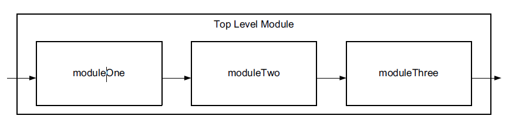

# Designing Protocol Processing Systems with Vivado High-Level Synthesis
## Overview
This tutorial describes how the Vivado High-Level Synthesis (HLS) tool enables higher productivity in protocol processing designs by providing abstractions in critical areas. This simplifies designs and makes them less error-prone. While the basics of implementing protocol processing designs using Vivado HLS are fairly straightforward, there are some subtle aspects that warrant a detailed explanation. This tutorial illustrates Basic Concepts and Code Examples for building a packet processing system in Vivado HLS.

Protocol processing on different levels is present in any modern communication system because any exchange of information requires the use of a communication protocol. The protocol typically contains packets. The packets must be created by the sender and reassembled at the receiver, while ensuring adherence to protocol specifications. This makes protocol processing ubiquitous. Consequently, protocol processing, and implementing protocol processing functionality efficiently, is important for FPGA design.

## Basic Concepts and Code Examples
This section provides guidelines and code examples for building a simple protocol processing system with Vivado HLS.
### Setting Up a Simple System
In Vivado HLS, the basic building block of a system is a C/C++ function. Building a system consisting of modules and submodules essentially means that a top-level function calls lower level functions. Figure 1 illustrates a simple three-stage pipeline example to introduce the basic concepts for system building in Vivado HLS. Protocol processing is typically performed in pipelined designs, with each stage addressing a specific part of the processing.



- Code Example 1-Creating a Simple System in Vivado HLS
```cpp
void topLevelModule(stream<axiWord> &inData, stream<axiWord> &outData) {
#pragma VHLS dataflow interval=1

#pragma HLS INTERFACE port=inData axis
#pragma HLS INTERFACE port=outData axis

static stream<ap_uint<64> > modOne2modTwo
static stream<ap_uint<64> > modTwo2modThree;

#pragma HLS STREAM variable = modOne2modTwo depth = 4;
#pragma HLS STREAM variable = modTwo2modThree depth = 4;

moduleOne(inData, modOne2modTwo);
moduleTwo(modOne2modTwo, modTwo2modThree);
moduleThree(modTwo2modThree, outData);
}
```
Code Example 1-Creating a Simple System in Vivado HLS creates the top module function that calls the other sub-functions. The top module function uses two parameters, both of which are objects of class stream, which is one of the template classes provided by the Vivado HLS libraries. A stream is a Vivado HLS modeling construct that represents an interface over which data is to be exchanged in a streaming manner. A stream can be implemented as a FIFO
queue or shift register, as detailed in the Vivado Design Suite User Guide: High-Level Synthesis (UG902). A stream is a template class that can be used with any C++ construct. 

### Creating Pipelined Designs
The last pragma to discuss is perhaps the most important one. The `dataflow` pragma in line2 of Code Example 1 instructs Vivado HLS to attempt to schedule the execution of all the sub-functions in this function in parallel. It is important to note that the effect of the `dataflow` pragma does not propagate down the hierarchy of the design. Thus, if a lower level function contains sub-functions whose execution has to be scheduled in parallel, then the `dataflow` pragma must be specified in that function separately. The parameter `interval` defines the Initiation Interval (`II`) for this module. `II` defines the throughput of the design by telling Vivado HLS how often this module has to be able to process a new input data word. This does not preclude the module being internally pipelined and having a latency greater than 1. An `II = 2` means that the module has 2 cycles to complete the processing of a data word before having to read in a new one. This can allow Vivado HLS to simplify the resulting RTL for a module. That being said, in a typical protocol processing application the design has to be able to process one data word in each clock cycle, thus from now on an II = 1 is used.Finally, you call the functions themselves. In Vivado HLS this also corresponds with the instantiations of the modules. The parameters that are passed to each module essentially define the module communication port. In this case, you create a chain of the three modules by connecting the input to the first module, then the first module to the second over stream `modOne2modTwo`, and so on.

### Finite State Machine using Vivado HLS
Protocol processing is inherently stateful. You are required to read in successive packet words arriving onto a bus over many clock cycles and decide on further operations according to some field of the packet. The common way to handle this type of processing is by using a state machine, which iterates over the packet and performs the necessary processing. Code Example 2 shows a simple state machine, which either drops or forwards a packet, depending on an input from a previous stage. The function receives three arguments: the input packet data over the `inData` stream, a one-bit flag that shows if a packet is valid or not over the `validBuffer` stream, and the output packet data stream, called `outData`. 

The pipeline pragma in line 2 of Code Example 2 instructs Vivado HLS to pipeline this function to achieve an initiation interval of 1 (`II=1`), meaning that it is able to process one new input data word every clock cycle. Vivado HLS examines the design and determines how many pipeline stages it needs to introduce to the design to meet the required scheduling restrictions. To describe this pragma a bit further, assume you are performing a read-modify-write operation. If it is not pipelined, an `II=1` cannot be met because scheduling dictates that the read occur in clock cycle T and the write in clock cycle T+1. This is the default behavior in Vivado HLS without the pipeline pragma. Inserting the pragma causes Vivado HLS to schedule the access in a way that the target II value can be reached.

- Code Example 2 - Finite State Machine using Vivado HLS
```
void dropper(stream<axiWord>& inData, stream<ap_uint<1> >&validBuffer, stream<axiWord>& outData){
#pragma HLS pipeline II=1

	static enum dState {D_IDLE = 0, D_STREAM, D_DROP} dropState;
	axiWord currWord = {0, 0, 0, 0};
	switch(dropState) {
		case D_IDLE:
			if (!validBuffer.empty() && !inData.empty()) {
				ap_uint<1> valid = validBuffer.read();
				inData.read(currWord);
				if (valid) {
					outData.write(currWord);
					dropState = D_STREAM;
				}
			}
			else
				dropState = D_DROP;
		break;
		case D_STREAM:
			if (!inData.empty()) {
				inData.read(currWord);
				outData.write(currWord);
				if (currWord.last)
					dropState = D_IDLE;
			}
		break;
		case D_DROP:
			if (!inData.empty()) {
				inData.read(currWord);
				if (currWord.last)
					dropState = D_IDLE;
				break;
			}
	}
}
```

Line 4 declares a static enumeration variable that expresses state in this FSM. Using an enumeration is optional but allows for more legible code because states can be given proper names. Line 5 declares a variable of type `axiWord`, in which packet data to be read from the input is stored. 

The switch statement in line 7 represents the actual state machine. Using a switch is recommended but not mandatory. An if-else decision tree would also perform the same functionality. The switch statement allows the tool to enumerate all the states and optimize the resulting state machine RTL code efficiently.

Execution starts at the D_IDLE state where the FSM reads from the two input streams in lines10 and 11. These two lines demonstrate both uses of the read method of the stream object. Both methods read from the specified stream and store the result into the given variable. This method performs a blocking read, which means that if the method call is not successfully executed, the execution of the remaining code in this function call is blocked. This happens when trying to read from an empty stream. 

### Stream Splitting and Merging
The ability to forward packets to different modules according to some field in the protocol stack, and then to recombine these streams before transmission, is a critical functionality in protocol processing. Vivado HLS allows for the use of high-level constructs to facilitate this, as Code Example 3 - Simple Stream Merge illustrates for the case of a stream merging.
- Code Example 3 - Simple Stream
```cpp
void merge(stream<axiWord> inData[NUM_MERGE_STREAMS], stream<axiWord>&outData) 
{
#pragma HLS pipeline II=1 enable_flush

	static enum mState{M_IDLE = 0, M_STREAM} mergeState;
	static ap_uint<LOG2CEIL_NUM_MERGE_STREAMS> rrCtr = 0;
	static ap_uint<LOG2CEIL_NUM_MERGE_STREAMS> streamSource = 0;
	axiWord inputWord = {0, 0, 0, 0};

	switch(mergeState) 
	{
	case M_IDLE:
		bool streamEmpty[NUM_MERGE_STREAMS];
#pragma HLS ARRAY_PARTITION variable=streamEmpty complete
		for (uint8_t i=0;i<NUM_MERGE_STREAMS;++i)
			streamEmpty[i] = inData[i].empty();
		for (uint8_t i=0;i<NUM_MERGE_STREAMS;++i) 
		{
			uint8_t tempCtr = streamSource + 1 + i;
			if (tempCtr >= NUM_MERGE_STREAMS)
				tempCtr -= NUM_MERGE_STREAMS;
			if(!streamEmpty[tempCtr]) {
				streamSource = tempCtr;
				inputWord = inData[streamSource].read();
				outData.write(inputWord);
				if (inputWord.last == 0)
					mergeState = M_STREAM;
				break;
			}
		}
	break;
	case M_STREAM:
		if (!inData[streamSource].empty()) 
		{
			inData[streamSource].read(inputWord);
			outData.write(inputWord);
			if (inputWord.last == 1)
				mergeState = M_IDLE;
		}
	break;
	}
}
```
In this example, a module merge is used, which has a stream array as input (inData) and a single stream (outData) as output. The purpose of this module  is to read from the input streams in a fair manner and output the read data to the output stream. The module is implemented as a two-state FSM, which is described using the same constructs that were previously introduced. The focus of the example is on how the merge functionality over the multiple streams is implemented. The first state in the FSM ensures fairness when choosing the input stream. This is done using a round-robin algorithm to go over the ueues. The algorithm starts looking for new data from the queue after the one that was accessed previously. Thus, for example, if in a four queue system, queue 2 was accessed in clock cycle T, in cycle T+1 the search for data to output starts with queue 3 and then goes on to 0, 1, and finally, 2. The code n lines 17-21 implements the round-robin algorithm. The constant NUM_MERGE_STREAMS specifies the number of streams that are to be merged. Subsequently, ine 22 tests the current stream, which is identified by the tempCntr variable for content. If it is not empty: 
- The current stream identified by `tempCntr` is set to be the active stream `streamSource = tempCtr;`.
- Data is read from that stream `inputWord = inData[streamSource].read();`.
- If the data word currently read in the input is not the last `if (inputWord.last == 0)`, the state machine moves to the `M_STREAM` state, where it outputs the remaining data word from the selected stream identified by `tempCntr`.
- When the last data word is processed, the FSM reverts to state `M_IDLE`, where it repeats the previous process.

### Extracting and Realigning Fields
Extracting and realigning fields is one of the most fundamental operations in packet processing. Because packets typically arrive in a module through a bus over multiple clock cycles, it is common that fields of interest are not aligned properly in the data word in which they arrive and/or these fields spawn multiple data words. To process the fields, they must be extricated from the data stream, buffered, and realigned for processing.
- Code Example 4 - Source MAC Address Extraction
```cpp
if (!inData.empty()) {
    inData.read(currWord);
    switch(wordCount) {
    case 0:
        MAC_DST = currWord.data.range(47, 0);
        MAC_SRC.range(15, 0) = currWord.data.range(63, 48);
    break;
    case 1:
        MAC_SRC.range(47 ,16) = currWord.data.range(31, 0);
    break;
    case 2:
...
```
Code Example 4 illustrates a simple field extraction and realignment case, in which the source MAC address is extracted from an Ethernet header. The data arrives over a 64-bit stream called `inData`. In each clock cycle the data is read in (line 2) and, depending on the data word read, the appropriate statement is executed. Thus, in line 6 the first 16 bits of the source MAC address are extracted and shifted to the beginning of the MAC_SRC variable. In the next clock cycle, the remaining 32 bits of the MAC address arrive on the bus and are placed in the 32 higher bits of the MAC_SRC variable.