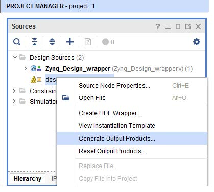
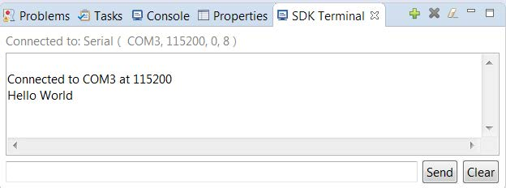

# Using HLS IP in a Zynq SoC Design

## Overview

A common use of High-Level Synthesis design is to create an accelerator for a CPU to move code that executes on the CPU into the FPGA programmable logic to improve performance. This tutorial shows how you can incorporate a design created with High-Level Synthesis into a Zynq device.

You create and configure a simple HLS design to work with the CPU on a Zynq device. The HLS design used in this lab is simple to allow the focus of the tutorial to be on explaining the connections to the CPU and how to configure the software drivers created by High-Level Synthesis to control the device and manage interrupts.

---
The tutorial design file can be downloaded from **src/T4/lab\***

The sample design is a simple multiple accumulate block. The focus of this tutorial exercise is the methodology, connections and integration of the software drivers. (The tutorial does not focus on the logic in the design itself.)

---

### **Lab: Implement Vivado HLS IP on a Zynq Device**
This lab exercise integrates both the High-Level Synthesis IP and the software drivers created by HLS to control the IP in a design implemented on a Zynq device.

#### Step 1: Create a Vivado HLS IP Block
1. Open the Vivado HLS Command Prompt.
    - On Windows use **Start > All Programs > Xilinx Design Tools > Vivado 2019.2 > Vivado HLS > Vivado HLS 2019.2 Command Prompt.**
    - On Linux, open a new shell.
2. Using the command prompt window, change the directory to the **src/T4/lab**.
3. Execute the Tcl script to setup the Vivado HLS project, using the command  
```
vivado_hls -f run_hls.tcl
```

   

When the script completes, there is a Vivado HLS project directory *vhls_prj*, which contains the HLS IP, including the Vivado IP Catalog archive for use in Vivado designs.

The remainder of this tutorial exercise shows **how the Vivado HLS IP blocks can be integrated into a Zynq design using IP integrator**.

#### Step 2: Create a Vivado Zynq Project
1. Launch the Vivado Design Suite (not Vivado HLS):
    - On Windows use **Start > All Programs > Xilinx Design Tools > Vivado 2019.1 > Vivado 2019.1.**
    - On Linux, type *vivado* in the shell.

2. From the Welcome screen, click **Create New Project**

3. In the New Project wizard:
    - Click **Next**.
    - In the Project Location text entry box browse to the location of the tutorial file directory src/T4/lab/hls_macc and click **Next**.
    - On the Project Type page, select RTL Project and **Do not specify sources at this time** (if it is not the default).
    - Click **Next**.

4. On the Default Part page:
    - Click Boards.
    - Select the **ZYNQ-7 ZC702 Evaluation Board**
    - Click **Next**.
    - Click **Finish** on the New Project Summary Page.

#### Step 3: Add HLS IP to the IP Catalog
1. In the Project Manager area of the Flow Navigator pane, click **IP Catalog**.

   

2. Right click in an open space(like the green square), and select **Add Repository**.
2. Right click in an open space on IP Catalog Canvas(like the green square) and select **Add Repository**.

3. In the IP Repositories dialog box, Browse to the location of the IP created by Vivado HLS, *T4\lab\hls_macc\vhls_prj\solution1\impl\ip* and click **Select**.

4. Click **OK** to close the IP repository manager.
5. There is now an HLS IP in the IP Catalog, Hls_macc.

   

#### Step 4: Creating an IP Integrator Block Design of the System

1. In the IP integrator area of the Flow Navigator, click **Create Block Design** and type *Zynq_Design* in the dialog box.

   

The Block Design view opens in the main pane, with a new Diagram tab, containing a blank
Block Design canvas.

2. Press the **Add IP** button on the main screen open the IP search dialog
    - Type *zynq* into the Search text entry box.
    - Select **ZYNQ7 Processing System** and press **Enter**.

An IP symbol for the ZYNQ7 Processing System appears on the canvas.

3. Double-click the **ZYNQ IP** symbol to open the associated Re-customize IP dialog box.
    - Click the **Presets** icon and select **ZC702**.

   

4. Click **MIO Configuration** in the Page Navigator pane.
    - Expand the **Application Processor Unit** tree view.
    - **Deselect** *Timer 0* (or any other timers if they are selected).

5. Click **Interrupts** in the Page Navigator pane.
    - Select **Fabric Interrupts** and expand its tree view and expand the PL-PS Interrupt Ports.
    - Select **IRQ_F2P[15:0]** and click **OK** to close the Re-customize IP dialog box.

   

IP integrator provides Designer Assistance to automate certain tasks, such as making the correct external connections to DDR memory and Fixed I/O for the ZYNQ PS7.

6. Click the **Run Block Automation** link under the title bar
    - Ensure **processing_system7_0** is selected.
    - Ensure **Apply Board Presets** is **deselected**. If this remains selected it re-applies the timers that were disabled in step 4 and results in additional ports on the Zynq block.
    - Click **OK** to complete in the resulting dialog box.

7. To add HLS IP to the design:
    - right-click in an open space of canvas and select **Add IP** from the context menu.
    - Type *hls* in the Search text entry box and press **Enter** to add it to design

8. Click the **Run Connection Automation** link at the top of the canvas.
9. Select */hls_macc_0/S_AXI_HLS_MACC_PERIPH_BUS* and click **OK** in the resulting dialog box to automatically connect the HLS IP to the *M_AXI_GP0* interface of the Zynq Processor.

This adds an AXI Interconnect (block instance: processing_system7_0), a Proc Sys Reset block and makes all necessary AXI related connections

The only remaining connection necessary is from the HLS interrupt port to the PS7 IRQ_F2P port.

10. Mouse over the interrupt pin on the hls_macc_0 IP symbol. When the cursor changes to pencil shape, click and drag to the IRQ_F2P[0:0] port of the PS7 and release, completing the connection.

   

?You can try the blue button and the green button to optimiza the layout and routing.?

11. Select the **Address Editor** tab and confirm that the *hls_macc_0* peripheral has been assigned a master address range. If it has **not**, right click the *hls_macc_0* and select the **Auto Assign Address icon**.
 

The final step in the Block Diagram design entry process is to validate the design.

12. Click the **Validate Design** icon in the toolbar.
13. Upon successful validation, save the Block Design.

#### Step 5: Implementing the System
Before proceeding with the system design, you must generate implementation sources and create an HDL wrapper as the top-level module for synthesis and implementation.

1. Return to the **Project Manager** view by clicking on Project Manager in the Flow Navigator.

2. In the Sources browser in the main workspace pane, a Block Diagram object called **Zynq_Design** is at the top of the Design Sources tree view?Maybe you need to change the view to **Hierarchy** if you cannot find **Design Sources**?. Right-click this object and select **Generate Output Products**.

3. In the resulting dialog box, click **Generate** to start the process of generating the necessary source files.

 

4. Right-click the *Zynq_Design* object again, select **Create HDL Wrapper**, and click **OK** to exit the resulting dialog box.

The top-level of the Design Sources tree becomes the *Zynq_Design_wrapper.v* file. The design is now ready to be synthesized, implemented and to have an FPGA programming bitstream generated.

5. Click **Generate Bitstream** under **Flow Navigator/PROGRAM AND DEBUG** to initiate the remainder of the flow. Click **Yes** and **OK** to implement the design.

6. In the dialog that appears after bitstream generation has completed, select **Open Implemented Design** and click **OK**.

#### Step 6: Developing Software and Running it on the ZYNQ System
You are now ready to export the design to Xilinx SDK. In SDK, you create software that runs on a ZC702 board (if available). A driver for the HLS block was generated during HLS export of the Vivado IP Catalog package. This driver must be made available in SDK so that the PS7 software can communicate with the block.

1. From the Vivado **File** menu select **Export > Export Hardware**.
**Note**: Both the IP integrator Block Design and the Implemented Design must be open in the Vivado workspace for this step to complete successfully.

2. In the Export Hardware dialog box , ensure that the **Include Bitstream** is *enabled* and click **OK**.

3. From the Vivado File menu, select **Launch SDK**. Click **OK** to open sdsoc.

5. From the SDK File menu, select **New > Application Project**.
    - In the New Project dialog enter the project name **Zynq_Design_Test**.
    - Click **Next**.
    - Select the **Hello World** template.
    - Click **Finish**.


6. Then you can power up the ZC702 board and test the Hello World application. However, we cannot do this step due to the remote learning. But you need to know that now you can print the "hello world" by FPGA board. This is the simplest project running on FPGA PS side.

The figure shows we can print the "Hello World" on terminal by UART.


#### Step 7: Modify Software to Communicate with HLS Block
You can modify the helloworld.c file to communicate with HLS IP block. The completely modified source file is available in the *arm_code* directory of the tutorial file set. You can open the file to see the details.

Then run the new application on the hardware and verify that it works as expected.


---

### **Conclusion**
In this tutorial, you learned:
- How to import an HLS design as IP into IP integrator.
- How to connect HLS IP to a Zynq SoC.

---
In previous HLS tutorial, we learned how to synthesize a c/c++ code to RTL implementation, and how to export it as an IP. And now, we learned how to use the generated IP on Zynq process platform. Next time, we focus on algorithm level. All the operations on Vivado and HLS could be hidden under the SDSOC environment.