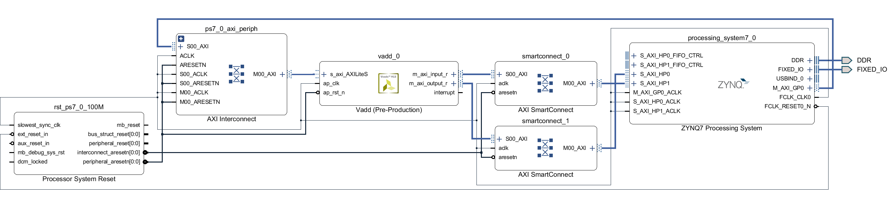
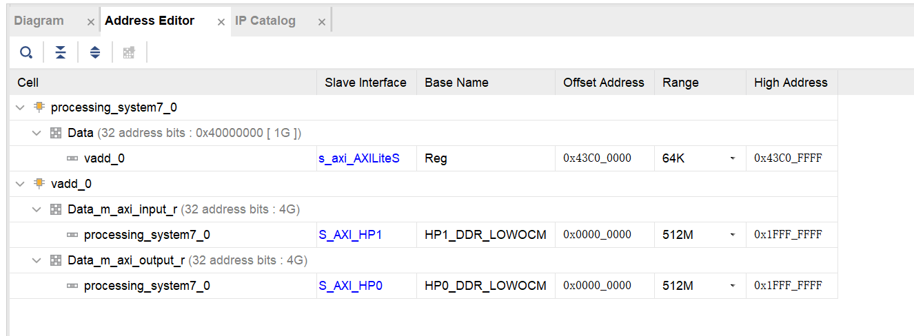

# Integrate a Vivado HLS IP with AXI4-MM interface
## Overview
In [T4.1](T4.1.md), we introduce how to integrate a Vivado HLS IP in a Zynq SoC design. However, in the previous tutorial, only AXI4-Lite interface is used, which can only transfer one data each time. When designing an accelerator, the AXI4-Lite interface can only be used to transmit the control commands of an accelerator. Massive data needs another interface with high throughput, and AXI4-Memory Map is such an interface. In this tutorial, we will demonstrate how to integrate a HLS IP with AXI4-MM interface and how to call the IP in userspace.
## HLS IP Generation
The code can be found in [<src/T4.2/src/vadd.cpp>](src/T4.2/src/vadd.cpp)
```
void vadd(int *a, int *b, int *o, int size)
{
#pragma HLS INTERFACE m_axi depth=2048 port=a offset=slave bundle=input
#pragma HLS INTERFACE m_axi depth=2048 port=b offset=slave bundle=input
#pragma HLS INTERFACE m_axi depth=2048 port=o offset=slave bundle=output
#pragma HLS INTERFACE s_axilite register port=size
#pragma HLS INTERFACE s_axilite register port=return

	int A[DATA_SIZE];
	int B[DATA_SIZE];
	int O[DATA_SIZE];
	for(int i = 0; i < size; i++)
	{
#pragma HLS PIPELINE
		A[i] = a[i];
	}
	for(int i = 0; i < size; i++)
	{
#pragma HLS PIPELINE
		B[i] = b[i];
	}
  vadd: for(int i = 0; i < size; i++) 
  {
#pragma HLS PIPELINE
    O[i] = A[i] + B[i];
  }
	for(int i = 0; i < size; i++)
	{
#pragma HLS PIPELINE
		o[i] = O[i];
	}
}
```
The function of `vadd` is quite simple, it loads vector A and vector B from DDR through AXI4-MM interface firstly and then calculate the result. After that, it exports the result back to DDR. 

You can find the driver for the `VADD` module under <VADD/solution1/impl/ip/drivers/vadd_v1_0/src> and the memory map is given in `xvadd_hw.h`. It will be used later.
```
// AXILiteS
// 0x00 : Control signals
//        bit 0  - ap_start (Read/Write/COH)
//        bit 1  - ap_done (Read/COR)
//        bit 2  - ap_idle (Read)
//        bit 3  - ap_ready (Read)
//        bit 7  - auto_restart (Read/Write)
//        others - reserved
// 0x04 : Global Interrupt Enable Register
//        bit 0  - Global Interrupt Enable (Read/Write)
//        others - reserved
// 0x08 : IP Interrupt Enable Register (Read/Write)
//        bit 0  - Channel 0 (ap_done)
//        bit 1  - Channel 1 (ap_ready)
//        others - reserved
// 0x0c : IP Interrupt Status Register (Read/TOW)
//        bit 0  - Channel 0 (ap_done)
//        bit 1  - Channel 1 (ap_ready)
//        others - reserved
// 0x10 : Data signal of a
//        bit 31~0 - a[31:0] (Read/Write)
// 0x14 : reserved
// 0x18 : Data signal of b
//        bit 31~0 - b[31:0] (Read/Write)
// 0x1c : reserved
// 0x20 : Data signal of o
//        bit 31~0 - o[31:0] (Read/Write)
// 0x24 : reserved
// 0x28 : Data signal of size
//        bit 31~0 - size[31:0] (Read/Write)
// 0x2c : reserved
// (SC = Self Clear, COR = Clear on Read, TOW = Toggle on Write, COH = Clear on Handshake)
```
## HLS IP Integration



Generate bitstream and copy the bitstream <VADD/VADD.runs/impl_1/VADD_wrapper.bit> along with the VADD.HWH <VADD/VADD.srcs/sources_1/bd/VADD/hw_handoff/VADD.H> to PYNQ-Z2<~/jupyter_notebooks/VADD>. Besides, rename the bitstream to `VADD.bit`, the bitstream's name should be the same with the HWH file, or the bitstream will not be loaded successfully.
## Developing Software and Running it on the PYNQ System
- Import related libraries
```
import numpy as np
from pynq import Xlnk
from pynq import Overlay
import pynq
```
Linux will virtulize the physical memory into pages, which is not friendly for accelerators. Xlnk is a private library of Xilinx and is responsible for allocating physical continuous memory in Python environment. Overlay enables the user to control the devices in PL in Python enviroment.
- Load the bitstream and initialize Xlnk
```
xlnk = Xlnk()
xlnk.xlnk_reset()
overlay = Overlay("./VADD.bit")
VADD = overlay.vadd_0
```
- Allocate memory and set the accelerator, you can regard `xlnk.cma_array` as `malloc`.
```
A = xlnk.cma_array(shape=(2048), dtype=np.int32)
B = xlnk.cma_array(shape=(2048), dtype=np.int32)
O = xlnk.cma_array(shape=(2048), dtype=np.int32)
```
- 
``` Set the parameters of the accelerator.
VADD.write(0x10, A.physical_address)
VADD.write(0x18, B.physical_address)
VADD.write(0x20, O.physical_address)
VADD.write(0x28, 2048)
```
You should tell the accelerator where they should load the data. 

- Prepare data
```
A_ = np.random.rand(2048)*2048
A_ = A_.round().astype(np.int32)
B_ = np.random.rand(2048)*2048
B_ = B_.round().astype(np.int32)
C_ = A_ + B_
O_ = np.empty(2048, dtype=np.int32)
np.copyto(A, A_)
np.copyto(B, B_)
```
The memory space allocated by Xlnk cannot be operated directly, you have to generate the data other where and copy the data to the memory space.
- Start the accelerator and wait until the computation finish.
```
VADD.write(0x00, 1)
isready = VADD.read(0x00)
while(isready==1):
  isready = VADD.read(0x00)
```

- Get the result and compare with the golden result.
```
np.copyto(O_, O)
print(A_)
print(B_)
print(C_)
print(O_)
===
[1154  515 1619 ..., 1505 1110  510]
[ 733  146  778 ..., 1953 1537 1753]
[1887  661 2397 ..., 3458 2647 2263]
[1887  661 2397 ..., 3458 2647 2263]
```