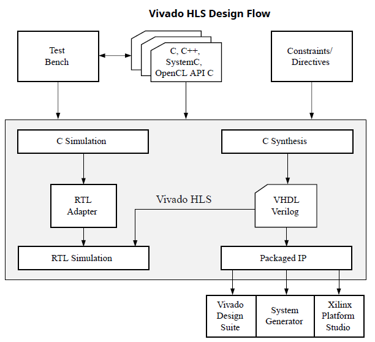
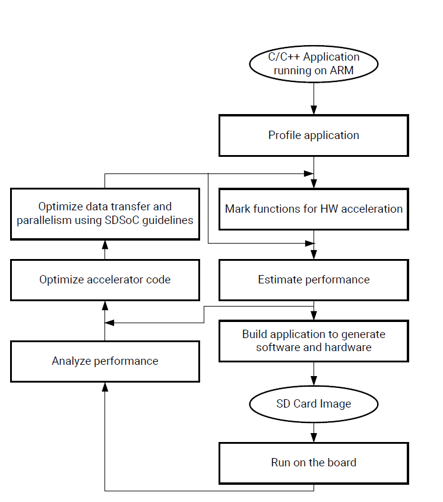
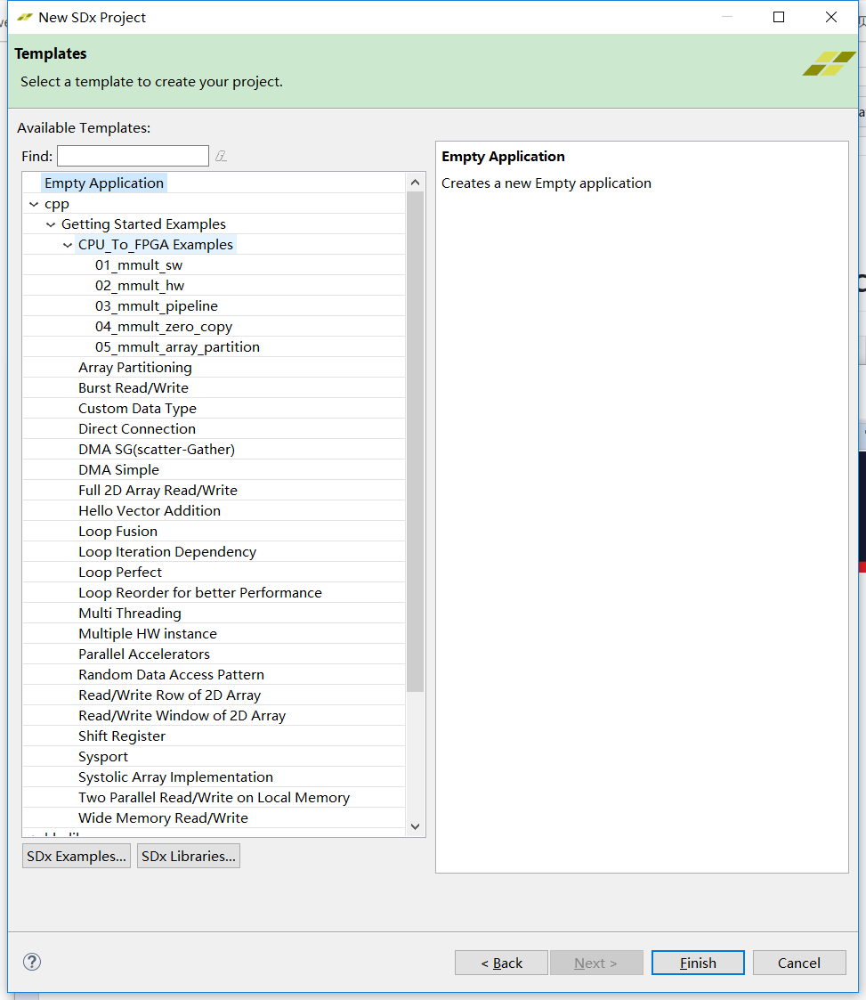
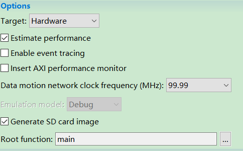

## Overview of the official tutorials on SDSOC(software-defined system-on-chip)

#### Comparison of HLS and SDSOC design flow 
Let's see how to obtain a desired packaged Ip and test it on FPGA.

  

    
     
    
Figure1: Vivado HLS Design Flow

By the design flow in figure 1, you can obtain a packagedd IP which passed the testbench. From [Tutorial 4](T4.md), a packaged IP can be used in a Zynq SoC Design with following steps?
1. Config the port, the clock and DDR of the processing sysem to match the packaged IP.
2. Connect the processing systenm with the packaged IP
3. Create the HDL Wrappper of the design block and generate the bitstream.
4. Add the C driver APIs to the testbench and test it.
5. With any errors, return to step 1 or to HLS.

But with SDSOC, the design flow is simplified a lot. (figure 2)
1. Write an application with C/C++/OpenCL code and test the functionality on the processing system(Arm CPU).
2. Mark the functions to be implemented on hardware (programming logic side).
3. Insert directives to optimize the PPA(power, performance,  area) of the functions on hardware. ?The function will be synthesized to a packaged IP?.
- The connections between PS and PL are implemented by SDSOC automatically. 
- Vivado HLS and Vivado are called implicitly by SDSOC. Algorithm engineers could accelerate their applications even without the knowledge of hardware. 

  

    
     
    
Figure2: SDSOC Design Flow

#### The official tutorials of SDSOC
This tutorial shows how to create an SDSoC� platform that can be used to accelerate software functions using the SDx� Integrated Design Environment (IDE) tool.

1. [Overview of SDSOC-Tutorials](https://github.com/Xilinx/SDSoC-Tutorials/tree/2018.2-Tutorials). 
2. [Download the SDx examples](https://github.com/Xilinx/SDSoC-Tutorials/blob/2018.2-Tutorials/getting-started-tutorial/lab-9-installing-applications-from-github.md):
   
3. [lab1: Introduction to the SDSoC Development Environment](https://github.com/Xilinx/SDSoC-Tutorials/blob/2018.2-Tutorials/getting-started-tutorial/lab-1-introduction-to-the-sdsoc-development-environment.md)
4. [Performance Estimation](https://github.com/Xilinx/SDSoC-Tutorials/blob/2018.2-Tutorials/getting-started-tutorial/lab-2-performance-estimation.md) 
    - **optional**
    - [*important*] In the SDx Project Settings in the Options panel, check the Estimate Performance box. This enables the estimation flow. 
    -  
5. [lab2: Optimize the port](https://github.com/Xilinx/SDSoC-Tutorials/blob/2018.2-Tutorials/getting-started-tutorial/lab-3-optimize-the-application-code.md)
    - Specify the port to obtain higher transfer performance.
6. [lab3: Optimize the Accelerator Using Directives](https://github.com/Xilinx/SDSoC-Tutorials/blob/2018.2-Tutorials/getting-started-tutorial/lab-4-optimize-the-accelerator-using-directives.md)
    - Example of **Pipeline** and **Array_partition** directives
7. [lab4: Task-Level Pipelining](https://github.com/Xilinx/SDSoC-Tutorials/blob/2018.2-Tutorials/getting-started-tutorial/lab-5-task-level-pipelining.md)

Any questions can be raised on [**Issue**](https://github.com/Liuhsinche/ECE-GY-6483-2021Fall/issues).