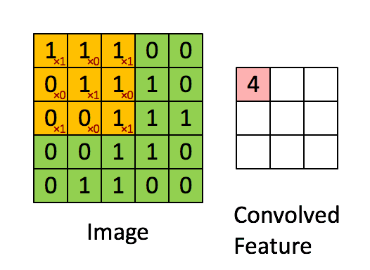

## Introduction

Convolutional neural network(CNN) is a very popular algorithm for implementing artificial intelligence in recent years. You can learn about convolutional neural networks through this course <http://cs231n.stanford.edu>. The convolution operation occupies the main computational load of CNN and can be given by the following equation:


$$
\operatorname {OFM} [ m ] \left[ or \right] \left[ oc \right] = \sum _ { n = 0 } ^ { N } \sum _ { kr = 0 } ^ { K } \sum _ { kc = 0 } ^ { K } \operatorname {W} [ m ] [ n ] [ kr ] [ kc ] \times \operatorname {IFM}[n][S \times or + kr - P][S \times oc + kc - P]
$$


where `OFM` stands for output feature map, `IFM` stands for input feature map, `W` stands for weight, `N` stands for the number of input feature maps, `m` and `n` stands for the index of input feature map and output feature map, `S` stands for stride, `r` and `c` stands for row and column and `P` stands for Padding.  An illustration of 2D CNN.



The C code of convolution is shown below

```c
void convolution(float *ifm, float *ofm, float *weight)
{
    for (int r = 0; r < OR; r++)
    {
        for (int c = 0; c < OC; c++)
        {
            for (int m = 0; m < M; m++)
            {
                float odata = 0;
                int ofm_index = m*OR*OC + r*OC + c;
                for (int n = 0; n < N; n++)
                {
                    for(int kr = 0; kr < K; kr++)
                    {
                        for (int kc = 0; kc < K; kc++)
                        {
                            float ret;
                            int ic = c*S - P + kc;
                            int ir = r*S - P + kr;

							if( (ic<0) || (ir<0) || (ic>(IC-1)) || (ir>(IR-1)))
                                ret=0;
                            else
                                ret = ifm[n*IR*IC + ir*IC + ic];
                            ret *= weight[m*N*K*K + n*K*K + kr*K + kc];
                            odata += ret;
                        }
                    }
                }
                ofm[ofm_index] = odata;
            }
        }
    }
}
```

In the above code, IR stands for input feature map's row, IC stands for input feature map's columm, OR stands for output feature map's row, OC stands for output feature map's columm.

## Requirement

In this tutorial, all the hyper parameters are fixed value, that is, M=16, OR=56, OC=56, N=16, IR=56, IC=56, K=3, S=1, P=1. Under the premise of ensuring the correct results, you can arbitrarily modify the given code as well as add the appropriate HLS and SDS pragmas to it. This project takes the time to complete the convolution of the `56*56*16` feature map as the key evaluation metrics. Also, try to reduce the resource consumption as much as possible.

## T6(T6/solution1)
(You can find the code under src/T6/base)
Add interface pragmas to make the convolution_hw synthesisable 
```c++
void convolution_hw(float *ifm, float *ofm, float *weight)
{
#pragma HLS INTERFACE m_axi depth=16*56*56 	    port=ifm		offset=slave
#pragma HLS INTERFACE m_axi depth=16*56*56		port=ofm		offset=slave
#pragma HLS INTERFACE m_axi depth=3*3*16*16		port=weight		offset=slave
#pragma HLS INTERFACE s_axilite register		port=return

...

}
```
Otherwise, you may encouter this error:
```
ERROR: [SYNCHK 200-61] T6_0/convolution.cpp:65: unsupported memory access on variable 'ifm' which is (or contains) an array with unknown size at compile time.
```
The baseline of T6 is shown below:

    +-----------+-----------+-----------+-----------+---------+
    |        Latency        |        Interval       | Pipeline|
    |    min    |    max    |    min    |    max    |   Type  |
    +-----------+-----------+-----------+-----------+---------+
    |  122486002|  180288754|  122486002|  180288754|   none  |
    +-----------+-----------+-----------+-----------+---------+
    +-----------------+---------+-------+--------+--------+-----+
    |       Name      | BRAM_18K| DSP48E|   FF   |   LUT  | URAM|
    +-----------------+---------+-------+--------+--------+-----+
    |DSP              |        -|      -|       -|       -|    -|
    |Expression       |        -|      -|       0|     582|    -|
    |FIFO             |        -|      -|       -|       -|    -|
    |Instance         |        2|      5|    1017|    1161|    -|
    |Memory           |        -|      -|       -|       -|    -|
    |Multiplexer      |        -|      -|       -|     341|    -|
    |Register         |        -|      -|     692|       -|    -|
    +-----------------+---------+-------+--------+--------+-----+
    |Total            |        2|      5|    1709|    2084|    0|
    +-----------------+---------+-------+--------+--------+-----+
    |Available        |      624|   1728|  460800|  230400|   96|
    +-----------------+---------+-------+--------+--------+-----+
    |Utilization (%)  |    ~0   |   ~0  |   ~0   |   ~0   |    0|
    +-----------------+---------+-------+--------+--------+-----+
    
## T6(T6/solution2)
In order to improve data locality, all the needed data should be loaded to PL before computing
```
void convolution_hw(float *ifm, float *ofm, float *wgt)
{
#pragma HLS INTERFACE m_axi depth=16*56*56 	    port=ifm	offset=slave
#pragma HLS INTERFACE m_axi depth=16*56*56  	port=ofm	offset=slave
#pragma HLS INTERFACE m_axi depth=3*3*16*16		port=wgt	offset=slave
#pragma HLS INTERFACE s_axilite register		port=return

	float IBUF[N][IR*IC];
	float OBUF[M][OR*OC];
	float WBUF[N*M][K*K];

	for(int n = 0; n < N; n++)
	{
		for(int r = 0; r < IR; r++)
		{
load_ibuf:	for(int c = 0; c < IC; c++)
			{
				IBUF[n][r*IC+c]=ifm[n*IR*IC+r*IC+c];
			}
		}
	}

	for(int nm = 0; nm < N*M; nm++)
	{
load_wgt:for(int kk = 0; kk < K*K; kk++)
		{
			WBUF[nm][kk]=weight[nm*K*K+kk];
		}
	}

    for (int m = 0; m < M; m++)
    {
        for (int r = 0; r < OR; r++)
        {
            for (int c = 0; c < OC; c++)
            {
                float odata = 0;
                for (int n = 0; n < N; n++)
                {
                    for(int kr = 0; kr < K; kr++)
                    {
                        for (int kc = 0; kc < K; kc++)
                        {
                            float ret;
                            int ic = c*S - P + kc;
                            int ir = r*S - P + kr;

							if( (ic<0) || (ir<0) || (ic>(IC-1)) || (ir>(IR-1)))
                                ret=0;
                            else
                                ret = IBUF[n][ir*IC + ic];
                            ret *= WBUF[m*N + n][kr*K + kc];
                            odata += ret;
                        }
                    }
                }
                OBUF[m][r*OC + c] = odata;
            }
        }
    }

	for(int m = 0; m < M; m++)
	{
		for(int r = 0; r < OR; r++)
		{
export_ofm:	for(int c = 0; c < OC; c++)
			{
				ofm[m*OR*OC+r*OC+c]=OBUF[m][r*OC+c];
			}
		}
	}
}
```
You can see the latency improves from 180288754 to 64599653 at the expense of BRAM usage burst from 2 to 191

    +----------+----------+----------+----------+---------+
    |       Latency       |       Interval      | Pipeline|
    |    min   |    max   |    min   |    max   |   Type  |
    +----------+----------+----------+----------+---------+
    |  64599653|  64599653|  64599653|  64599653|   none  |
    +----------+----------+----------+----------+---------+
    +-----------------+---------+-------+--------+--------+-----+
    |       Name      | BRAM_18K| DSP48E|   FF   |   LUT  | URAM|
    +-----------------+---------+-------+--------+--------+-----+
    |DSP              |        -|      -|       -|       -|    -|
    |Expression       |        -|      -|       0|    1164|    -|
    |FIFO             |        -|      -|       -|       -|    -|
    |Instance         |        2|      5|    1017|    1161|    -|
    |Memory           |      189|      -|       0|       0|    0|
    |Multiplexer      |        -|      -|       -|     532|    -|
    |Register         |        -|      -|    1090|       -|    -|
    +-----------------+---------+-------+--------+--------+-----+
    |Total            |      191|      5|    2107|    2857|    0|
    +-----------------+---------+-------+--------+--------+-----+
    |Available        |      624|   1728|  460800|  230400|   96|
    +-----------------+---------+-------+--------+--------+-----+
    |Utilization (%)  |       30|   ~0  |   ~0   |       1|    0|
    +-----------------+---------+-------+--------+--------+-----+


## T6(T6/solution3)

Putting the loops to be unrolled innermost helps to reduce the synthesis time and increase the success rate. Reorder the loops and unroll the loops in the dimension of input channel and output channel. The following loops are called perfect loop nest for only the innermost loop has loop body content. There is no logic specified between the loop statements and all the loop bounds are constant.
```c++
    for(int kr = 0; kr < K; kr++)
    {
        for (int kc = 0; kc < K; kc++)
        {
        	for (int r = 0; r < OR; r++)
        	{
convolution:	for (int c = 0; c < OC; c++)
        		{
					for (int m = 0; m < M; m++)
					{
#pragma HLS UNROLL
						float odata = OBUF[m][r*OC + c];
						for (int n = 0; n < N; n++)
						{
#pragma HLS UNROLL
							float ret;
							int ic = c*S - P + kc;
							int ir = r*S - P + kr;
							if( (ic<0) || (ir<0) || (ic>(IC-1)) || (ir>(IR-1)))
								ret=0;
							else
								ret = IBUF[n][ir*IC + ic];
							ret *= WBUF[m*N+n][kr*K + kc];
							odata += ret;
						}
						OBUF[m][r*OC + c] = odata;
					}
				}
            }
        }
    }
```
You can see the latency improves from 64599653 to 2391181 at the expense of DSP48E usage burst from 5 to 116

    +---------+---------+---------+---------+---------+
    |      Latency      |      Interval     | Pipeline|
    |   min   |   max   |   min   |   max   |   Type  |
    +---------+---------+---------+---------+---------+
    |  2391181|  2391181|  2391181|  2391181|   none  |
    +---------+---------+---------+---------+---------+
    ================================================================
    == Utilization Estimates
    ================================================================
    * Summary: 
    +-----------------+---------+-------+--------+--------+-----+
    |       Name      | BRAM_18K| DSP48E|   FF   |   LUT  | URAM|
    +-----------------+---------+-------+--------+--------+-----+
    |DSP              |        -|      -|       -|       -|    -|
    |Expression       |        -|      -|       0|    6805|    -|
    |FIFO             |        -|      -|       -|       -|    -|
    |Instance         |        2|    116|    7028|    7272|    -|
    |Memory           |      189|      -|       0|       0|    0|
    |Multiplexer      |        -|      -|       -|    6011|    -|
    |Register         |        -|      -|   16099|       -|    -|
    +-----------------+---------+-------+--------+--------+-----+
    |Total            |      191|    116|   23127|   20088|    0|
    +-----------------+---------+-------+--------+--------+-----+
    |Available        |      624|   1728|  460800|  230400|   96|
    +-----------------+---------+-------+--------+--------+-----+
    |Utilization (%)  |       30|      6|       5|       8|    0|
    +-----------------+---------+-------+--------+--------+-----+

## T6(T6/solution4)
Add `#pragma HLS PIPELINE` to proper position can significantly improve the system throughput without consuming many resources. 
```
	for(int n = 0; n < N; n++)
	{
		for(int r = 0; r < IR; r++)
		{
load_ibuf:	for(int c = 0; c < IC; c++)
			{
#pragma HLS PIPELINE
				IBUF[n][r*IC+c]=ifm[n*IR*IC+r*IC+c];
			}
		}
	}

	for(int nm = 0; nm < N*M; nm++)
	{
load_wgt:for(int kk = 0; kk < K*K; kk++)
		{
#pragma HLS PIPELINE
			WBUF[nm][kk]=wgt[nm*K*K+kk];
		}
	}

    for(int kr = 0; kr < K; kr++)
    {
        for (int kc = 0; kc < K; kc++)
        {
        	for (int r = 0; r < OR; r++)
        	{
convolution:    for (int c = 0; c < OC; c++)
        		{
#pragma HLS PIPELINE II=1
					for (int m = 0; m < M; m++)
					{
#pragma HLS UNROLL
						float odata = OBUF[m][r*OC + c];
						for (int n = 0; n < N; n++)
						{
#pragma HLS UNROLL
							float ret;
							int ic = c*S - P + kc;
							int ir = r*S - P + kr;
							if( (ic<0) || (ir<0) || (ic>(IC-1)) || (ir>(IR-1)))
								ret=0;
							else
								ret = IBUF[n][ir*IC + ic];
							ret *= WBUF[m*N+n][kr*K + kc];
							odata += ret;
						}
						OBUF[m][r*OC + c] = odata;
					}
				}
            }
        }
    }   

	for(int m = 0; m < M; m++)
	{
		for(int r = 0; r < OR; r++)
		{
export_ofm:	for(int c = 0; c < OC; c++)
			{
#pragma HLS PIPELINE
				ofm[m*OR*OC+r*OC+c]=OBUF[m][r*OC+c];
			}
		}
	}
```
A decreasement perfromance is obtained compared to solution3, which is below our expectations.

    +---------+---------+---------+---------+---------+
    |      Latency      |      Interval     | Pipeline|
    |   min   |   max   |   min   |   max   |   Type  |
    +---------+---------+---------+---------+---------+
    |  3715426|  3715426|  3715426|  3715426|   none  |
    +---------+---------+---------+---------+---------+
    +-----------------+---------+-------+--------+--------+-----+
    |       Name      | BRAM_18K| DSP48E|   FF   |   LUT  | URAM|
    +-----------------+---------+-------+--------+--------+-----+
    |DSP              |        -|      6|       -|       -|    -|
    |Expression       |        -|      -|       0|    8100|    -|
    |FIFO             |        -|      -|       -|       -|    -|
    |Instance         |        2|     10|    3680|    3166|    -|
    |Memory           |      189|      -|       0|       0|    0|
    |Multiplexer      |        -|      -|       -|    2967|    -|
    |Register         |        0|      -|    4551|     448|    -|
    +-----------------+---------+-------+--------+--------+-----+
    |Total            |      191|     16|    8231|   14681|    0|
    +-----------------+---------+-------+--------+--------+-----+
    |Available        |      624|   1728|  460800|  230400|   96|
    +-----------------+---------+-------+--------+--------+-----+
    |Utilization (%)  |       30|   ~0  |       1|       6|    0|
    +-----------------+---------+-------+--------+--------+-----+

As we can see from the report, although the convolution operation is pipelined, the II is 128. 

        +-------------------+---------+---------+----------+-----------+-----------+-------+----------+
        |                   |      Latency      | Iteration|  Initiation Interval  |  Trip |          |
        |     Loop Name     |   min   |   max   |  Latency |  achieved |   target  | Count | Pipelined|
        +-------------------+---------+---------+----------+-----------+-----------+-------+----------+
        |- L_L_load_ibuf    |    50203|    50203|        29|          1|          1|  50176|    yes   |
        |- L_load_wgt       |     2327|     2327|        25|          1|          1|   2304|    yes   |
        |- L_L_convolution  |  3612686|  3612686|       143|        128|          1|  28224|    yes   |
        |- L_L_export_ofm   |    50201|    50201|        27|          1|          1|  50176|    yes   |
        +-------------------+---------+---------+----------+-----------+-----------+-------+----------+
From the console, the following warning appears:
```
WARNING: [SCHED 204-69] Unable to schedule 'load' operation ('WBUF_load_32', convolution_t6/src/convolution.cpp:78) on array 'WBUF', convolution_t6/src/convolution.cpp:52 due to limited memory ports. Please consider using a memory core with more ports or partitioning the array 'WBUF'.
INFO: [SCHED 204-61] Pipelining result : Target II =`1, Final II = 128, Depth = 143.
```

The pipeline is blocked since IBUF and WBUF can provide only 2 datas (why?) per cycle, but 256 weights and 16 inputs are needed if II=1. 

## T6(T6/solution5)
Add `#pragma HLS ARRAY_PARTITION` to the BUFs to improve data throughput.
```c++
	float IBUF[N][IR*IC];
#pragma HLS ARRAY_PARTITION variable=IBUF complete dim=1
	float OBUF[M][OR*OC];
#pragma HLS ARRAY_PARTITION variable=OBUF complete dim=1
	float WBUF[N*M][K*K];
#pragma HLS ARRAY_PARTITION variable=WBUF complete dim=1
```
You can see the latency drops from 2391181 to 131030 and the II drops from 128 to 1

    +--------+--------+--------+--------+---------+
    |     Latency     |     Interval    | Pipeline|
    |   min  |   max  |   min  |   max  |   Type  |
    +--------+--------+--------+--------+---------+
    |  131030|  131030|  131030|  131030|   none  |
    +--------+--------+--------+--------+---------+

    +-------------------+-------+-------+----------+-----------+-----------+-------+----------+
    |                   |    Latency    | Iteration|  Initiation Interval  |  Trip |          |
    |     Loop Name     |  min  |  max  |  Latency |  achieved |   target  | Count | Pipelined|
    +-------------------+-------+-------+----------+-----------+-----------+-------+----------+
    |- L_L_load_ibuf    |  50203|  50203|        29|          1|          1|  50176|    yes   |
    |- L_load_wgt       |   2327|   2327|        25|          1|          1|   2304|    yes   |
    |- L_L_convolution  |  28290|  28290|        68|          1|          1|  28224|    yes   |
    |- L_L_export_ofm   |  50201|  50201|        27|          1|          1|  50176|    yes   |
    +-------------------+-------+-------+----------+-----------+-----------+-------+----------+
However, the DSP48E usage is increasd to 1284.

    +-----------------+---------+-------+--------+--------+-----+
    |       Name      | BRAM_18K| DSP48E|   FF   |   LUT  | URAM|
    +-----------------+---------+-------+--------+--------+-----+
    |DSP              |        -|      4|       -|       -|    -|
    |Expression       |        -|      -|       0|    2273|    -|
    |FIFO             |        -|      -|       -|       -|    -|
    |Instance         |        2|   1280|   93850|   91877|    -|
    |Memory           |      256|      -|   16384|    1280|    0|
    |Multiplexer      |        -|      -|       -|    4769|    -|
    |Register         |        2|      -|   27882|    1742|    -|
    +-----------------+---------+-------+--------+--------+-----+
    |Total            |      260|   1284|  138116|  101941|    0|
    +-----------------+---------+-------+--------+--------+-----+
    |Available        |      624|   1728|  460800|  230400|   96|
    +-----------------+---------+-------+--------+--------+-----+
    |Utilization (%)  |       41|     74|      29|      44|    0|
    +-----------------+---------+-------+--------+--------+-----+
    
## T6(T6/solution6)
A. Now that the buffers are partitioned, the structure of load_ibuf,load_wgt and export_ofm can be changed to access 16 datas in one cycle.

```
	for(int r = 0; r < IR; r++)
	{
load_ibuf:	for(int c = 0; c < IC; c++)
		{
#pragma HLS PIPELINE
			for(int n = 0; n < N; n++)
			{
				IBUF[n][r*IC+c]=ifm[n*IR*IC+r*IC+c];
			}
		}
	}

load_wgt:
	for(int kk = 0; kk < K*K; kk++)
	{
#pragma HLS PIPELINE
		for(int nm = 0; nm < N*M; nm++)
		{
			WBUF[nm][kk]=weight[nm*K*K+kk];
		}
	}

	for(int r = 0; r < OR; r++)
	{
export_ofm:	for(int c = 0; c < OC; c++)
		{
#pragma HLS PIPELINE
			for(int m = 0; m < M; m++)
			{
				ofm[m*OR*OC+r*OC+c]=OBUF[m][r*OC+c];
			}
		}
	}
```
However, the interface is unable to transfer more datas due to the limited memory port.
warnign:
 ```
WARNING: [SCHED 204-69] Unable to schedule bus request on port 'gmem' (convolution_t6/src/convolution.cpp:63) due to limited memory ports. Please consider using a memory core with more ports or partitioning the array.
INFO: [SCHED 204-61] Pipelining result : Target II = 1, Final II = 16, Depth = 25.
...
 ```

B. Try to use DATA_PACK to pack data together. The DATA_PACK optimization directive is used for packing all the elements of a struct into a single wide vector. This allows all members of the struct to be read and written to simultaneously. [More details see ug1253 or ug902]

The code are given in src/T6/data_pack.

1. define a structure with 16 data
```
struct DT16
{
	DT data[16];
};
```
2. pack the input data from DT to DT16. fm_DT_2_DT16() and w_DT_2_DT16().
3. obtain the packed data from DDR. Load_WBUF(), Load_IBUF()

Result:

    +-------+-------+-------+-------+---------+
    |    Latency    |    Interval   | Pipeline|
    |  min  |  max  |  min  |  max  |   Type  |
    +-------+-------+-------+-------+---------+
    |  34746|  34746|  34746|  34746|   none  |
    +-------+-------+-------+-------+---------+

    +-------------------+-------+-------+----------+-----------+-----------+-------+----------+
    |                   |    Latency    | Iteration|  Initiation Interval  |  Trip |          |
    |     Loop Name     |  min  |  max  |  Latency |  achieved |   target  | Count | Pipelined|
    +-------------------+-------+-------+----------+-----------+-----------+-------+----------+
    |- L_load_wgt       |    163|    163|        21|          1|          1|    144|    yes   |
    |- load_ibuf        |   3137|   3137|         3|          1|          1|   3136|    yes   |
    |- L_L_convolution  |  28290|  28290|        68|          1|          1|  28224|    yes   |
    |- export_ofm       |   3137|   3137|         3|          1|          1|   3136|    yes   |
    +-------------------+-------+-------+----------+-----------+-----------+-------+----------+

    +-----------------+---------+-------+--------+--------+-----+
    |       Name      | BRAM_18K| DSP48E|   FF   |   LUT  | URAM|
    +-----------------+---------+-------+--------+--------+-----+
    |DSP              |        -|      -|       -|       -|    -|
    |Expression       |        -|      -|       0|    1474|    -|
    |FIFO             |        -|      -|       -|       -|    -|
    |Instance         |       90|   1280|   95458|   94437|    -|
    |Memory           |      256|      -|   16384|    1280|    0|
    |Multiplexer      |        -|      -|       -|    4709|    -|
    |Register         |        2|      -|   28475|    1454|    -|
    +-----------------+---------+-------+--------+--------+-----+
    |Total            |      348|   1280|  140317|  103354|    0|
    +-----------------+---------+-------+--------+--------+-----+
    |Available        |      624|   1728|  460800|  230400|   96|
    +-----------------+---------+-------+--------+--------+-----+
    |Utilization (%)  |       55|     74|      30|      44|    0|
    +-----------------+---------+-------+--------+--------+-----+

The latency of load_wgt, load_ibuf and export_ofm is reduced nearly 16 times(PACK_NUM) at the expense of BRAM usage burst from 260 to 348.

## Reference: Use buffer 
Buffer are common used in FPGA design for data locality. Take HW6 for example, blocks of matrix B need to be reused. You can create a BBUF to cache the whole 1024*1024 B matrix in a number of BRAMs. However, assume only block_size\*block_size data are to be accessed in one loop, you can create 2 block_size\*block_size Ping-pong buffer to cache the needed data. 

```
load_buffer(P);
for(int i = 0; i < N; i++)
{
    if(i%2==0)
    {
        load_buffer(Q);
        process(P);
    }
    else
    {
        load_buffer(P);
        process(Q);
    }
}
```

If you want to transfer B matrix in a sequencial mode, you need to consider window buffer and line buffer.

*src/T6/line_buffer* is an example of line buffer and window buffer. More details are on Prof.Ha's lesson.
